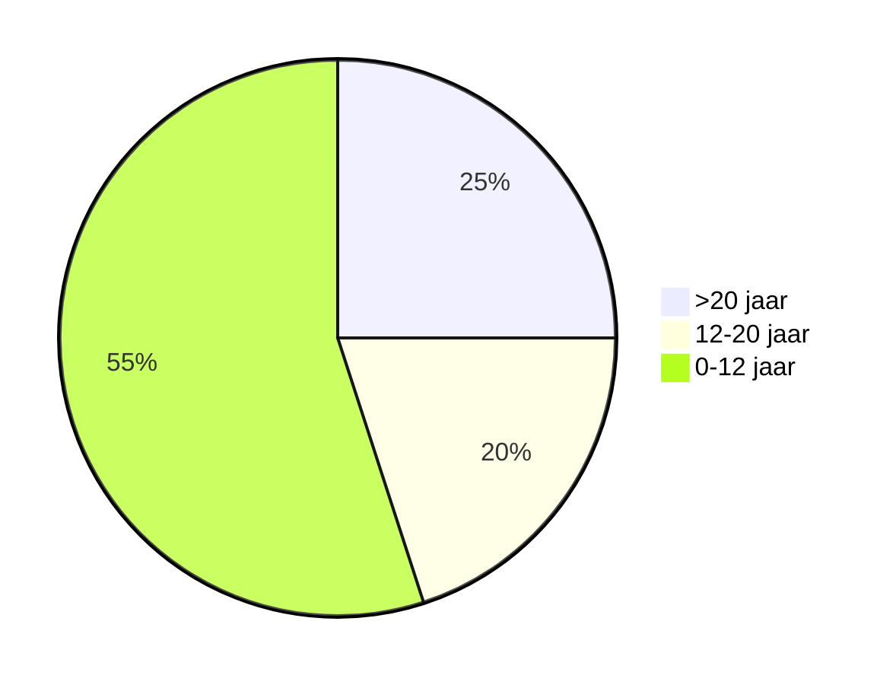
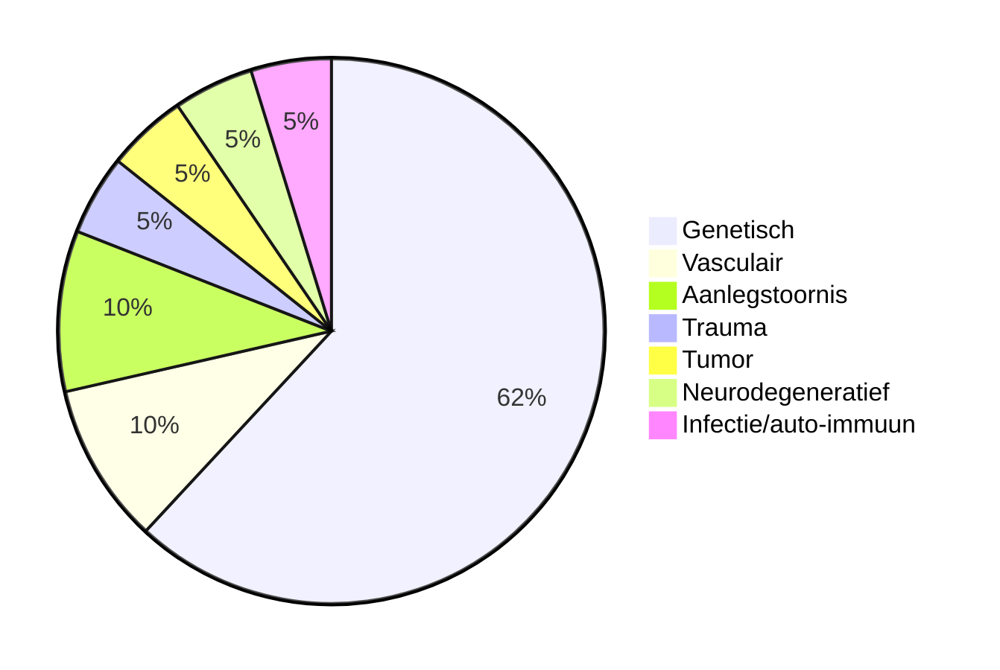

## Epileptische aanval/Ictus

📖 *Ictus = stoot = epileptische aanval*

> Niet alles wat trekt, schokt of wegvalt is een epileptische aanval
> 

**Klinische verschijnselen van:**

- *Abnormale,*
- *Overmatige,*
- *Synchrone,*
- *Ontlading* van een verzameling,
- *Corticale* neuronen.

**Definitie epilepsie**

- 2 of meer epileptische aanvallen binnen een jaar.
- Geen “wegneembare” uitlokkende factor.

**Nieuwe definitie bij volwassenen**

- 1 aanval en > 70% kans op een tweede aanval.

**Hulpmiddel herkennen epileptische aanval**

|  | Epileptisch | Niet-epileptisch |
| --- | --- | --- |
| Luxerend moment | - | + |
| Tongbeet | + | - |
| Postictale fase | + | - |
| Ictale EEG-afw. | + | - |
| Te doorbreken | - | + |

**Overige symptomen**

**Toddse parese:** krachtsverlies door uitputting van neuronen waardoor de neuronen tijdelijk refractair zijn voor hernieuwde stimulatie.

**Rood schuim:** verschijnsel bij tongbeet.

>[!BOX] **Syncope vs epileptische aanval**
>
>| Syncope                         | Epileptische aanval                    |
> |:------------------------------- |:-------------------------------------- |
> | Aanleiding (lang staan, emotie) | Geen aanleiding                        |
> | Vooraf bleek, zweten, misselijk | Soms gastric rising sensation, deja vu |
>|                                 | Wegdraaien hoofd                       |
>| Bewusteloosheid kortdurend      | Bewusteloosheid langdurend             |
>| Kortdurend trekkingen           | Langerdurende trekkingen               |
>| Bleke kleur                     | Blauwe verkleuring                     |
>| Nadien direct alert             | Nadien vaak verward                    |
>| Geen tongbeet                   | Tongbeet (lateraal), bloed in de mond                                       |

## Epidemiologie epilepsie

- 5% ooit tijdens het leven een aanval
- 3-4% kinderen een koortsstuip
- Bij mannen komt epilepsie 15% vaker voor dan bij vrouwen.

**Prevalentie** 

7-8 per 1000 (100.000-120.000)

**Incidentie**

4 per 10.000 (6000)
Epileptisch debuut naar leeftijd

    

**Epilepsie en leeftijd**

- Kinderen:
    - Als gevolg van hersenbeschadiging rondom de geboorte
    - Of agv aanlegstoornis hersenen
    - Of agv genetische/metabole aandoening (metabool is vaak ook genetisch)
    - Of agv meningo-encephalitis (infectieus of auto-immuun) of [[Abces]] ([[Hersenabces]])
    - Of agv hydrocephalus met hoge druk
    - Zelden door hersentumor
- Senioren
    - Vaak als gevolg van hersenbeschadiging zoals een herseninfarct of hersenbloeding
    - Soms door hersentumor

## Classificatie epilepsie

**Focaal <-> gegeneraliseerd**

|  | Focaal | Gegeneraliseerd |
| --- | --- | --- |
| Epileptische activiteit hersenen | In een deel | In de hele hersenen |
| Bewustzijnsverlies | Hoeft niet, kan wel | Altijd |
- **Afbeelding:** Focaal vs gegeneraliseerd
    
    
    

### PNEA

- Psychogenic Non Epileptic Attack
- Klinisch opserveerbare paroxysmale veranderingen in **gedrag** en/of **bewustzijn**, die **lijken op**  epileptische aanvallen, maar niet samen gaan met de typisch elektrofysiologische veranderingen horend bij epileptische aanvallen.
- De aanvallen zijn een ontlading van emotionele spanning
- N.B. 1 op de 5 mensen met epileptische aanvallen heeft ook PNEA’s

**Epileptisch insult <-> PNEA**

- Dit is niet gemakkelijk.
- Epileptische aanvallen hebben vaak een bepaalde opbouw in frequentie en amplitude, het schokken wordt aanvankelijk steeds heftiger en dooft dan geleidelijk aan weer uit, schokken bij PNEA hebben niet deze opbouw. Ze wisselen veel meer in frequentie.
- Tijdens een gegeneraliseerde epilepsie aanval is een persoon buiten
bewustzijn, mensen in een PNEA reageren vaak nog wel in bepaalde mate
op hun omgeving

### Classificatie focale aanval en gegeneraliseerde aanval

### Focale aanvallen

Focaal begin met secundaire generalisatie, een aanval die focaal begint kan in korte tijd generaliseren. Dit kan zo snel gaan dat het lastig is om te herkennen dan een aanval focaal begonnen is.

****Focale aanval met intacte gewaarwording****

Voorheen eenvoudig partiële aanval genoemd.

- Aanval blijft beperkt tot een klein deel van de hersenen.
- Het bewustzijn blijft helder.
- Mensen beseffen dus goed dat ze een aanval hebben en kunnen vertellen wat ze tijdens een aanval beleven.
- De duur kan zeer verschillend zijn, van seconden tot minuten.
- Focale aanvallen met intacte gewaarwording zijn soms zo licht dat anderen de aanval niet opmerken.

**Focale aanval met verminderde gewaarwording**
Voorheen complex partiële aanval genoemd.

- Bewustzijn geheel of gedeeltelijk verdwenen.
- De verschijnselen zijn heel verschillend.
- Soms alleen een (sterk) verlaagd bewustzijn:
    - De persoon staart voor zich uit en reageert niet op aanspreken.
- Vaak zijn er **automatismen**; deze zijn subtiel (friemelen, smakken), of onrustig (uitkleden, weg willen lopen), of heftig (trappelen, dreigend of agressief gedrag).

### Gegeneraliseerde aanvallen

Gegeneraliseerde aanvallen worden ook wel aanvallen met een gegeneraliseerd begin genoemd. Ze beginnen in en beïnvloeden beide hersenhelften tegelijkertijd. Dit gebeurt plotseling zonder waarschuwing. Iemand is bewusteloos (behalve bij myoclonische aanvallen), soms maar voor enkele seconden. Na de aanval weet iemand niet wat er tijdens de aanval gebeurd is.

Een gegeneraliseerde aanval wordt verder ingedeeld in motorisch of niet-motorisch. Bij motorisch is er sprake van bewegingen en bij niet-motorisch is dat niet het geval.

****Absence (meestal bij een kind)****

- Tijdens een absence staart iemand 3 tot 30 seconden voor zich uit, en hervat de bezigheden daarna weer alsof er niets is gebeurd.
- Soms zijn er subtiele bewegingen of schokjes.
- Er zijn geen of minimale motorische verschijnselen.
- Het kind valt niet en er gebeuren zelden ongelukken bij de aanval, omdat de spierspanning niet verandert en de balans niet verstoord raakt.

---

Er bestaan 2 soorten absence epilepsie

1. Kinderabsence epilepsie
    - Ontstaat gemiddeld vanaf de leeftijd van 6-7 jaar
    - Aanvallen zijn frequent
    - Aanvallen reageren goed op medicatie
    - Na een jaar kan de medicatie worden afgebouwd
2. Juveniele absence epilepsie
    - Ontstaat gemiddeld vanaf de leeftijd van 9 jaar
    - Aanvallen weinig frequent
    - Aanvallen reageren goed op medicatie
    - Medicatie zeker door gaan tot na puberteit, vaak zelfs levenslang

---

Bij het ontstaan van absence epilepsie spelen veranderingen in het DNA een belangrijke rol.

Waarschijnlijk is het ontstaan van absence epilepsie multifactorieel bepaald.

---

- Juveniele absence epilepsie is sterk verwant aan een andere vorm van gegeneraliseerde epilepsie die we juveniele myoclonus epilepsie noemen.
- Dit is de meest voorkomende epilepsie op de tienerleeftijd.
- Naast absences komen bij deze vorm van epilepsie nog twee ander type aanvallen voor.

---

**Juveniele myoclonus epilepsie**

Jongeren met juveniele myoclonus epilepsie hebben vaak 3 typen aanvallen:

- Myoclonieën in de ochtend (denk aan het filmpje van het meisje die in de ochtend haar broodje liet vallen door een schok).
- Absences.
- Tonisch clonische aanvallen.
- Deze vorm van epilepsie reageert vaak goed op lage dosering valproaat of levetiracetam.

**Tonisch-clonische aanval**
- Meest bekende aanval, maar niet de meest voorkomende.
- Deze aanval wordt ook wel toeval, insult of grote aanval genoemd. Vroeger sprak men ook wel over 'grand mal'.
- Tonisch-clonisch betekent verkrampt en schokkend. De naam geeft aan wat tijdens een aanval gebeurt.

**Myoclonische aanval**
- Hierbij trekken spieren in armen en/of benen zich vrij plotseling samen waardoor schokjes optreden.
- Soms gaat het om één schokje, soms om een hele serie. Een enkele keer doet het hele lichaam mee.
- De schokjes duren zo kort dat het bewustzijn niet of niet waarneembaar wordt verstoord. Als de spierschokjes hevig zijn, kan iemand vallen.
- Een myoclonische aanval duurt kort en mensen herstellen zich snel na een aanval.

**Atoon**
- Verslappen van de spieren.
- De aanval begint plotseling.
- Zonder waarschuwing vooraf zakt iemand in elkaar en kan daarbij hard vallen, meestal naar voren.
- Om verwondingen te voorkomen, dragen mensen met dergelijke aanvallen vaak een valhelm.
- De bewusteloosheid duurt maar een paar seconden. Na het vallen staat iemand direct weer op.

In de aanvalsclassificatie kan een atone aanval vallen onder een focale aanval met motorisch begin of onder een gegeneraliseerde aanval met een motorische kenmerken.

**Salaamkrampen**
Salaamkrampen is een typische vorm van epilepsie-aanvallen bij jonge kinderen tussen enkele maanden en twee jaar oud.

- Het is een ernstige vorm van epilepsie.
- Zorgt voor een stop of zelfs terugval van de ontwikkeling.
- Prompte behandeling met prednison kan deze vorm van epilepsie onderdrukken en mogelijk maken dat de ontwikkeling weer verder gaat.
- Dit is uiteraard wel afhankelijk van de onderliggende oorzaak
- Onderliggende oorzaken zijn:
    - Hypoxisch-ischaemische hersenschade
    - Status na doormaken (intra-uteriene) infectie
    - Sanlegstoornissen van de hersenen door genetische oorzaak
    - Metabole aandoening

## Syndromen epilepsie

**Syndroom van West**

Wanneer een kind **salaamkrampen** heeft, in combinatie met onderstaand **typisch EEG** (alle EEG lijnen lopen door elkaar heen, hypsaritmie genoemd) en **stop in de ontwikkeling.**

**EEG west**

    

**Rolandische epilepsie**

- Meest voorkomende epilepsie op lagere schoolleeftijd
- Focale epilepsie
- Focaal begin trekkingen rondom de mond en kwijlen
- Deel secundaire generalisatie

**Juveniele myoclonus epilepsie**

- Meest voorkomende epilepsie op de puberleeftijd
- Drie typen aanvallen:
    - Myoclonieen mn in de ochtend
    - Abcenses
    - Tonisch clonische aanvallen

**Koortsstuip**

- Typische koortsstuipen tellen niet mee voor de definitie van epilepsie
- De hersenen van jonge kinderen kunnen snel oplopende lichaamstemperatuur niet goed verdragen en reageren daarop door het maken van een koortsstuip
- Met het ouder worden verdwijnt deze gevoeligheid. Na de leeftijd van 4
jaar komen koortsstuipen steeds minder vaak voor.
- Epileptische aanval uitgelokt door koorts zonder dat er bij een kind sprake is van epilepsie
- 3-4% van alle kinderen

## Etiologie

- Acuut symptomatisch
    - < 1 week (geen epilepsie !!!)
- Laat symptomatisch (structureel)
    - 1 week
- Genetisch/metabool
- Onbekend
    - Onderliggende oorzaak (nog) niet aantoonbaar

### **Oorzaken ontstaan van epilepsie**

1. Structurele afwijking in de hersenen (aanlegstoornis, herseninfarct, hersentumor, hersenabces etc)
2.  Genetisch/metabool (monogenetische veranderingen in het DNA, multifactorieel)
3.  Restgroep met onbekende oorzaak
- Focale aanvallen zijn vaak structureel.
- Primair gegeneraliseerde aanvallen zijn vaak genetisch.

Maar vaak betekent niet altijd !

## Behandeling

****Handelen bij een epilepsie-aanval of koortsstuip****

- Blijf rustig
- Stop niets tussen de tanden !
- Houd armen en benen niet tegen (deze kunnen anders breken)
- Houd de tijd bij
    - Wanneer de aanval na 3 minuten nog niet over is, kijk dan of de persoon noodmedicatie bij zich heeft en dien dit dan toe
    - Bel 112 indien de aanval na 3 minuten nog niet over is en de persoon geen noodmedicatie bij zich heeft
- Leg de persoon in stabiele zijligging wanneer de aanval over is.
- NB wanneer de aanval vanzelf stopt en de persoon bekend is met epilepsie dan is het niet nodig om een ambulance te bellen

### **Medicatie**

**Benzodiazepinen**

De meest gebruikte benzodiazepinen zijn diazepam in de vorm van een rectiole en midazolam in de vorm van een neusspray. 

Ze worden toegediend wanneer een aanval na 3-5 minuten nog niet spontaan gestopt is.

Zij stimuleren de GABA-receptor in de hersenen. Dit heeft een inhiberende werking op diverse andere neuronen.

****Anti-epileptica****

Er bestaan ook medicijnen die dagelijks ingenomen moeten worden die de
kans op het ontstaan van nieuwe epileptische aanvallen kunnen
verminderen.

- Deze medicijnen worden anti-epileptica genoemd.
- Er bestaan verschillende werkingsmechanismen (bijvoorbeeld aangrijpen op natriumkanalen).
- Er zijn breedspectrum anti-epileptica die kunnen verschillende type aanvallen voorkomen. Er zijn ook smal spectrum anti-epileptica die werken met name voor een specifiek type aanvallen en kunnen bij ander type aanvallen niet of averechts werken.

Breedspectrum

- Valproaat
- Levetiracetam
- Lamotrigine
- Benzodiazepines
- Zonisamide

Smalspectrum

- Ethosuximidi
- Toparimaat
- Carbamazepine
- Oxacabazepine

**Keuze anti-epilepticum**

- Voordelen breed spectrum anti-epileptica:
    - Vaak voor alle aanvalstypen geschikt.
    - Vaak krachtige middelen met grote kans op effect.
- Nadelen
    - Vaak meer bijwerkingen dan een smalspectrum anti-epilepticum.

**Bijwerkingen**

- Allergische reacties (ernstige bijwerking)
- Vermoeidheid
    - Medicatie onderdrukt de activiteit van de hersenen licht.
    - Hierdoor kunnen sommigen zich moe of traag voelen.
- Beven
- Gewichtstoename
- Haaruitval

### **Leefregels**

- Zwemmen in een zwembad: alleen wanneer er continu toezicht is van iemand die bereid is in het water te springen wanneer de persoon een aanval krijgt.
- Een bad nemen: alleen onder continu toezicht.
- Niet op hoogtes werken of verblijven.
- Helm op in het verkeer.
- Regels wanneer wel en niet is toegestaan een (vracht)auto/bus te besturen (N.B. voor fiets bestaan deze regels niet).
- **Autorijden**
    
    
    

### Andere behandelopties dan medicatie

- Epilepsiechirurgie
    - Weghalen epileptisch focus of disconnectie rechter en linker hemisfeer
- Ketogeen dieet
    - Vetrijk en koolhydraatarm
- Nervus vagusstimulator
    - Pacemaker die de nervus vagus stimuleert
- Behandeling met corticosteroiden
    - Onderdrukking secundaire inflammatie en direct anti-epileptisch effect

### **Valproaat - teratogeen**

- Valproaat heeft een teratogeen effect tijdens zwangerschap, het veroorzaakt o.a. een vergrote kans op spina bifida bij de foetus.
- Daarnaast lijkt er ook een verband te zijn tussen het gebruik van valproaat en het ontstaan van een polycysteus ovariumsyndroom (PCOS). PCOS heeft een negatieve invloed op de vruchtbaarheid.

## Diagnostiek

- Kan het beste een MRI scan gemaakt worden.
- Een CT-scan zal alleen in acute situaties gemaakt worden wanneer het niet mogelijk is om een MRI-scan te maken. Een MRI scan laat veel meer details zien dan een CT-Scan
- Een EEG kan wel aantonen waar in de hersenen epileptiforme activiteit aanwezig is, maar niet wat de oorzaak er van is
- Genetisch onderzoek is nu nog niet aan de orde. De meeste structurele afwijkingen in de hersenen hebben geen genetische oorzaak

**EEG**

Kijkt vooral naar het soort aanval.