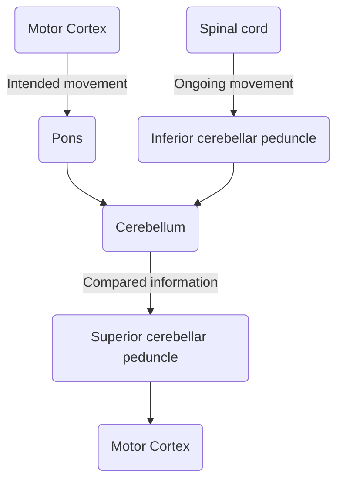

### Neurons
- There are around 100 billion neurons in the brain  
- Each neuron is connected to 1000 -200.000 other neurons 15000 synapses /neuron

(1) Pyramidal cell, cerebral cortex. (2) Neuroendocrine cell, hypothalamus. (3) Spiny neuron, corpus striatum. (4) Basket cell, cerebellum. A, axon; AC, axon collateral; D, dendrites

---

**Neuron**: receives, conducts, sends chemical mediated electrical signals via synapses; synaptic transmission
**Receptive**: receives information from other neurons On **dendrites** + **soma**
**Conducting** information (action potentials) **axon**

**Effector**: signal transduction 
Release: Neurotransmitters = chemical messengers 
**Axon terminal, bouton terminal synapse**

#### Glial cells
10x number of neurons! 
**Function**: structural, metabolic and functional support
- Transport nutrients
- Isolation axons 
- NGF/repair 
- Controls composition extracellular fluid

### Nervous system
---
- **CNS**:
	- Brain
	- Spinal cord
- **PNS**: 
	- Cranial nerves 12p
	- Spinal nerves 31p

### Central nervous system
---
**Consists of**: brain and spinal cord 
**Location**: in skull and vertebral column 

**Functions**: 
- Perception 
- Movement 
- Learning memory 
- Personality 
- Emotions behavior 
- Consciousness 
- Language


##### Spinal cord
The ‘gray matter’ (neurons) is located centrally, surrounding the canalis centralis. ‘butterfly’
The ‘white matter’ is located peripherally, and contains ascending as well as descending fibre tracts.

#### Subdivisions of the CNS
Based on Embryological development: 5 brain vesicles: 
- Telencephalon 
- Diencephalon 
- Mesencephalon 
- Metencephalon 
- Myelencephalon (medulla oblongata) + spinal cord (Medulla spinalis)


| Primaire hersenblaasjes | Secundaire hersenblaasjes | Ventrikel |
| --- | --- | --- |
| 1\. prosencephalon | 1\. telencephalon | Laterale ventrikels ("1e +2e") |
|  | 2\. diencephalon | 3e ventrikel |
| 2\. mesencephalon | 3\. mesencephalon | aquaduct |
| 3\. rhombencephalon | 4\. metencephalon | 4e ventrikel |
|  | 5\. myelencephalon | 4e ventrikel |

## White matter
---
#### Corpus callosum 
Corpus callosum connects en projects neurons from the two hemispheres. 
[[Sexual dimorphism]]: connection between L & R is larger in women en thicker. 

#### Corona radiata + capsula interna


Neurons project to the brain stem, these structures convert and dive to the brainstem. Fibers form a crown, the corona radiata. 
Lentiform nucleus: contain 2 of the basal ganglia. 

The capsula interna and corona radiata have the same fibers, but are named based on different locations.

## Gray matter in white matter
---


In the white matter are groups of nerve bodies, called nuclei or ganglia. 

**Lentiform nucleus**:
- Putamen
- Globus pallidus

## Gray matter
---
Gyri: windings (become smaller in AD)
Sulci: groves (become wider in [[Alzheimer]])

Alzheimer: los of white matter and nerve cell bodies in the cortex. Los big parts of the hippocampus.

#### Cortex
0.5 cm thick, contains billions of neurons. 
Cortex is not the same everywhere, different types of cortex.


**1909 Brodman**
Cortex consist of different layers and regions.
Divided the cortex in different lobes. 


##### Lateralisation

**Broca:** taalexpressie: zorgt voor motorische expressie van taal
(spreken, schrijven & typen).
**Het gebied van Wernicke** zorgt voor begrip van taal. De fasciculus arcuatus verbindt de gebieden. Bij rechtshandigen is de linker hemisfeer dominant (gebied dat de schrijfhand aanstuurt).


##### Somatotopy


**Plasticity cortex**
Somatosensory maps different spieces.
Cortex is plastic, somatosensory cortex changes after "training"


#### Neurogenesis
**2 sites of neurogenesis:**
- Subventricular zone of lateral ventricle 
- Subgranular zone of dentate gyrus


#### Diencephalon
**Thalamus**: relay/schakel center cortex: sensory and motor control. 
**Hypothalamus**: behaviour and visceral/autonomic/hormonal control. Attached to the hypofyse. 
**Development of the diencephalon**: [[Development of the nervous system]]
**Sulcus hypothalamus**: border between the thalamus and the hypothalamus.


##### Thalamus
Contains different regions. 
Thalamo-cortical and cortico-thalamic relations: **bidirectional**


##### Hypothalamus


Part of Limbic system
- Motivation and behaviour
- Internal state
- Autonomic functions, homeostasis

Hypothalamic control of the pituitary (hypohysis) and hormonal regulation.

###### Hypothalamus behavior
Damage to the ventromedial nuclei:
- No feeling of satiation, cat keeps eating. 
Damage to extreme lateral part of the hypothalamus:
- Los of appetite.

#### Mesencephalon


Only area that did not divide during development. 
Above the aquaduct: **tectum** (roof)
**Tergmentum** (roofed): runs underneath the aquaduct.
Pedunculus cerebri

##### Tegmentum


**Substantia nigra:** [[Parkinson]], dopaminergic neurons, contain pigment: black (nigra), project to the basal ganglia, motor function. 
**Nucleus ruber:** 'red nucleus', motor control.  
**Periaqueductal gray (PAG):** surrounds aqueduct, involved in pain control. 
**Pedunculi cerebri:** fibre tracts (motor).

##### Tectum

**Colliculus superior/inferior**: visual and auditive reflexes. 
- Visual information goes straight to the colliculus superior. (Owl that catches mouse before seeing/realising).
- **Periaqueductal gray (PAG):** surrounds aqueduct, involved in pain control. 

#### Metencephalon


Pons + cerebellum fibers (motor systems and crossing)
**Pons**: nuclei of cranial nerve V, many fibre tracts, crossing fibres from and to cerebellum. 
**Function cerebellum**: motor system, compares movement from motor system and ongoing movement. Movement can be corrected, improved and learned. 



**Development**


**Cereberllar Peduncles**


**Many cranial nerves derive from the metencephalon.** 


#### Myenlencephalon 
Myenlencephalon: medulla oblongata
- Cranial nerves VI to XII;
- Many fiber tracts: motor ventral and sensory dorsal
- **Nuclei:** sensory, motor and visceral!


**Pyramid tracts**: thick motor fibers from the motor cortex to the spinal cord. 
Decussation of pyramids: kruising van de pyramidale banen. 


## Supporting structures
---
#### Meningen
De hersenvliezen/meningen zitten om het centraal zenuwstelsel (hersenen en ruggenmerg).

- De **pia mater** (zachte hersenvlies) die precies om de hersenen zit.
- De [[arachnoïd mater]] (spinnenwebvlies).
    - Hiertussen zit de **[[subarachnoïdale]]** ruimte met arteriën, venen en CSF.
    - Arachnoïd is verbonden met de pia mater via dunne voetjes (**trabeculae**) en vormt zo de subarachnoïdale ruimte.
    - Pia en arachnoïd: **leptomeningen** (zachte vliezen)
- De **dura mater** (harde hersenvlies). De dura vormt schotten tussen de hersenhelften en tussen grote en kleine hersenen.
    - Vormt falx cerebri en tentorium cerebelli, bestaan uit dubbele laag dura.
    - Deze schotten zorgen voor compartimenten in schedelholte.
    - In het wervelkanaal omvat de dura het ruggenmerg, de uittredende zenuwwortels en de spinale ganglia.
---
**Lagen van de dura mater**
De dura mater bestaat uit twee lamina: 
- (1) de **lamina externa** (periosteal layer) zit stevig vast aan het periosteum
- (2) de **lamina interna** (meningeal layer) grenst aan de Arachnoidea mater.

De lamina interna vormt ook sterke plaatvormige durale septa, die afzonderlijke delen van de hersenen van elkaar scheiden en de hele hersenen in de schedel stabiliseren. 
De dural septa/dural duplications omvatten de:
- **Falx cerebri** ('cerebrale halvemaan'): zit tussen de linker en rechter hersenhelft.
- **Tentorium cerebelli** ('cerebellaire tent'): tussen het cerebrum en cerebellum.
	- Een spleet tussen de poten (crura) van het tentorium cerebelli ( Incisura tentorii ) maakt de doorgang van de hersenstam mogelijk.
- **Falx cerebelli** ('cerebellaire halvemaan')
- **Diafragma sellae**. 

Er bestaan potentiële ruimtes tussen dura en schedelbeenderen: de epidurale ruimte, en tussen dura en arachnoidea: de subdurale ruimte. In elk van deze ruimtes kan een bloeding optreden.

---

![[Pasted image 20220918172511.png|Meningen|450]]
![[Pasted image 20220918172655.png|Lagen van de dura|400]]

---

Tussen de binnenste en buitenste lagen van de dura komen met endotheel beklede ruimten voor, die sinus worden genoemd. Een sinus bevat veneus bloed, en de grootste is de **sinus sagittalis superior**, die bloed verzamelt van de superieure cerebrale aders op de convexiteit van de hersenhelften. 

Bij de samenvloeiing van sinussen wordt deze bloedstroom verbonden door de **sinus sagittalis inferior** en de **sinus rectus**, die bloed afkomstig van respectievelijk de mediale en de binnenste delen (v. cerebri magna) van de hersenhelften aanvoeren. Vanuit de samenvloeiing van sinussen voeren de transversale en sigmoïde sinussen het veneuze bloed naar de interne halsslagader, via het foramen jugularis. De takken van de gepaarde middle meningeal arteries. lopen tussen de binnenste en buitenste lagen van de dura, en zorgen voor de arteriële vascularisatie van de dura. Hun distributiepatroon met anterieure en posterieure takken is zichtbaar in de dura en in de binnenkant van de schedel. Beschadiging van deze slagaders kan leiden tot epi- of extradurale bloedingen. 

![[Pasted image 20220918182216.png|Sinus sagittalis superior|340]] 


---
##### Arachnoidea & Pia mater

Het **arachnoïd** en de **pia mater** kunnen als één geheel worden beschouwd, de "pia-arachnoïd", omdat zij uitgebreid met elkaar verbonden zijn via fijne bindweefselstrengen: **trabeculae**. 

Het belangrijkste verschil is echter dat het arachnoïd de dura mater volgt en alle onregelmatigheden van het hersenoppervlak overbrugt, terwijl de pia de contouren van de hersenen volgt en alle onregelmatigheden van het hersenoppervlak overbrugt. 

*Subarachnoidale ruimte*
De ruimte tussen arachnoid en pia, de subarachnoidale ruimte, bevat cerebrospinaal vocht (CSF) dat binnenstroomt uit de enkele mediane en twee laterale openingen van de vierde ventrikel. Naast de sagittale sinus superior kunnen arachnoïde granulaties worden waargenomen, bestaande uit aggregaties van arachnoïde villi, die door openingen in de dura in de sinus uitsteken, om CSF in de veneuze bloedstroom af te scheiden. 

Waar de subarachnoïdale ruimte zich verbreedt tot holtes, worden deze subarachnoïdale cisternen genoemd. De belangrijkste zijn: 
- de **cerebello-medullaire cisterne** (cisterna magna)
- de **lumbale cisterne**. Wordt bezet door de zenuwwortels van de caudale medulla (cauda equina). Beide kunnen worden afgetapt voor analyse van CSF (cisterna- of lumbaalpunctie) en in de lumbale cisterne kan een spinaal anestheticum worden toegediend.

 
![[Pasted image 20220918202744.png|400]]
```ad-summary
title: Clinical Notes
collapse: open

- **Extra-(epi-)dural hematomas**: middle meningeal artery .

- **Subdural hematomas**: superficial brain veins entering dural sinus.

- **Intracranial pressure**: supra- and infra-tentorial compartments, tonsillar herniation .

- **Hydrocephalus**: increased production or decreased absorption of CSF.

- **Meningitis**: viral or bacterial infection of pia-arachnoid.

- **Lumbar puncture**: between vertebrae L3 – L5 .


```

#### Cerebrospinale vloeistof
- Geproduceerd in de **ventrikels**, door de plexus choroïdeus.
	- Deze plexus bevindt zich in de laterale ventrikels en in de derde en vierde ventrikels. 
- Functie:
    - Hoofdfunctie: schokdemping en bescherming van hersenen en ruggenmerg: niet te veel druk van hersenen op merg. Zorgt dat de hersenen drijven.
    - Nevenfunctie: aanvoer van voedingsstoffen en de afvoer van afvalstoffen.
- Stroming liquor: van laterale ventrikels → 3e en 4e ventrikel → door openingen in 4e ventrikel → naar subarachnoïdale ruimte → granulaties in die ruimte → veneuze sinussysteem.
---
Cerebrospinale vloeistof wordt vanuit het arachnoid opgenomen in de veneuze sinus sagittalis door speciale orgaantjes, de granulationes arachnoideae.

- Het grootste deel van de cerebrospinale vloeistof wordt uitgescheiden door de plexus choroideus in de ventrikels.
- Gaat vanaf laterale ventrikels naar het derde ventrikel via het **foramen van monro** (foramen interventriculare).
- Het derde en vierde ventrikel communiceren via het **aqueductus mesencephali** (aquaduct van sylvius).
- Het vierde ventrikel heeft **drie openingen naar de arachnoidale ruimte**:
	- De Apertura mediana (Foramen van Magendie) en de gepaarde Aperturae laterales (Foramina van Luschka).
	

![[Screenshot 2022-09-18 at 19.59.57.png|Ventricles of the brain|400]]

---

![[Screenshot 2022-09-18 at 20.29.59.png|450]]
 ![[Screenshot 2022-09-18 at 20.30.55.png|350]]
---
## Blood supply of the brain
---

#### Arterieel
Hersenen wegen 1500 gram, terwijl maar 15-20% van het HMV er heen gaat. De bloedvoorziening gaat via:

1) Interne Carotus systeem: a. carotis interna (ongeveer 70% van de totale bloedtoevoer toevoer), die de schedel binnenkomen via het carodite kanaal. Vertakt vanuit de a. carotis communis. De a. carotis communis komt vanuit de aortaboog, samen met de a. subclavia (als de trucus brachiocephalicus).

2) Het Basilair Systeem: de vertebrale arterien (ongeveer 30%), die binnenkomen door het foramen magnum. De a. vertebralis is een tak van de a. subclavia. De L+R a. vertebralis voegen samen tot de a. basilaris. De basilaris en de beiden carotiden sluiten onder het diencephalon aan op de cirkel van Willis. 

##### cirkel van Willis

- De **cirkel van Willis** verbindt beide routes met elkaar.

Bij 70% van de mensen is de cirkel van Willis niet compleet.

De cirkel zorgt ervoor dat uitval van een van de arteriën kan worden opgevangen door de andere arteriën. 

Niet altijd perfect of compleet → belangrijk bij verschillende problemen. A. carotis interna is een van de belangrijkste arteriën in de hersenen. 

 
    
    
    
    ![[Screenshot 2022-09-19 at 17.05.56.png|450]]

---


**Interne carotis:** 
- Na het binnendringen van de schedel via het halsslagaderkanaal bereikt elke interne halsslagader de subarachnoïdale ruimte, net caudaal van het optisch chiasme. 
- Na enkele zijtakken te hebben afgegeven (a. choroidea anterior), die in caudolaterale richting lopen om een deel van de plexus choroïdeus in de inferieure hoorn van de laterale ventrikel te voeden, en posterieure communicerende slagaders, die in caudale richting lopen om zich bij de arteria cerebri anterior posterior te voegen), verdeelt de interne halsslagader zich in twee belangrijke eindtakken: de arteria cerebri anterior en de arteria cerebi media.

**The anterior cerebral artery (ACA)**:
- Basal ganglia, corpus callosum
- Medial part hemispheres
- Upper part frontal and parietal lobes

**The Middle Cerebral Artery (MCA)**
- Frontal lobe, parietal lobe, insula
- Internal capsule
- Grey matter temporal lobe
- Anterior hippocampus

**The Posterior Cerebral Artery (PCA):** 
- Thalamus 
- Temporal and occipital lobe
- Hippocampus
```ad-note
title: [[Blood vessel pathology in Alzheimer's disease]]


```


---
**The Basilar system**
Het basilaire systeem ontstaat door het samenkomen van de twee vertebrale arteriën aan de posterieure zijde en de twee posterieure cerebrale arteriën aan de frontale zijde, deze buigen langs het laterale deel van de midbrain om de mediale en inferieure zijdes van de temporaal en occipitaal kwabben te bereiken. (Zie afbeelding: [[#cirkel van Willis]])

*The Posterior Cerebral Artery (PCA):* 
- Proximale takken (via via posterior perforated space → hypothalamus and thalamus)
- Laterale (temporaal) en mediale takken (occipitaal, *carcarine* en *collosal*) 
- Verbonden met de a. carotis interna door de a. communicans posterior. 

**Arterial supply of the Hindbrain** 
De hersenstam en het cerebellum worden voorzien van bloed door de vertebrale en basilaire arteriën en de takken daarvan. 

The two vertebral arteries (Fig 3.2) (← for. magnum ← forr. transversaria of  the upper 6 cervical vertebrae ← subclavian artery) unite at the lower border of the pons  to form the basilar artery.
**Vertebral arteries (paired):** 
- → posterior inferior cerebellar artery (PICA) (Fig 3.2), supplying dorsolateral medulla oblongata and posterior/inferior parts of cerebellum; 
- → anterior spinal artery, unpaired, supplying (para)median parts of the medulla oblongata, before descending in vertebral canal.

**Basilar artery (unpaired):** 
- →  anterior  inferior  cerebellar  artery  (AICA), supplying upper medulla and inferior surface of cerebellum; 
- → pontine and internal auditory (labyrinthine) arteries, supplying pons and membranous labyrinth of inner ear;
- → superior cerebellar artery (SCA), along the upper border of the pons to superior surface of cerebellum;
- (→ posterior cerebral arteries, the 2 terminal branches supplying part of the forebrain, see above).

#### Venous drainage of the brain
De oppervlakkige cerebrale venen liggen ook in de subarachnoidale ruimte en draineren in de intercraniale veneuze sinussen. 

Een diepe cerebrale vene verschijnt onder het caudale corpus callosum (great cerebral vein or v. cerebri magna of Galen), deze draineert de interne cerebrale venen in de sinus rectus. 

```ad-summary
title: Clinical notes
collapse: open

-   **Cerebrovascular accidents** ([[CVA]]) (frequent involvement of the arteries providing 
the internal capsule, with serious consequences!). 
-    **Stroke** (atherosclerosis, ischemia, e.g. from internal carotid artery, effects dependent on size and location). 
-    **Occlusion**; embolism (p. 297-302 Fitzgerald). 
-    **Hemorrhage** (p. 301-302 Fitzgerald).
-    **Angiography**, (by injecting contrast medium via a catheter into a vertebral or carotid artery). 
-   **Aneurysms in the circle of Willis** → extensive subarachnoid hemorrhage.
```


---


#### Links and references

[[Anatomie CZS]]
[[Meningen]]


