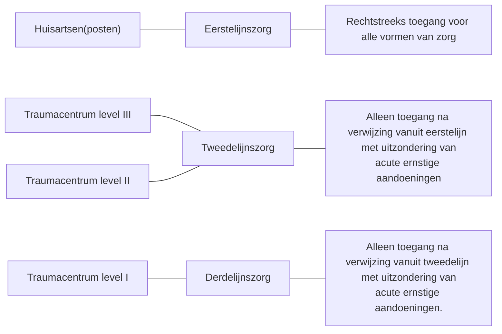

### Definities
#### Acute zorg
**Definitie van acute zorg volgens Schrijvers (2003)**:
> Zorg in situaties waarin zonder acuut ingrijpen gevaar is voor overlijden of irreversibele gezondheidsschade.

**Definitie van acute zorg volgens werkgroep (NVT-NOV) (2016)**:
> Diagnostiek en behandelingen waarbij binnen een beperkte tijd het aannemelijk is dat de uiteindelijke uitkomst negatief beïnvloed wordt. 

**Definitie van acute zorg volgens VWS (2006)**:
> - Een door de zorgvrager en/of zorgverlener ervaren onvoorziene en onmiddellijke behoefte aan diagnostiek en behandeling.
> - **Let op:** Het begrip acute zorg hangt af van de definitie en het perspectief: Afhankelijk van de definitie valt de hulpverlening bij ernstig ongemak of ongerustheid van een persoon wel of niet onder de acute zorg.

#### Categorieën en verdeling van acute zorg volgens Nederlands Triage Systeem:
- **U0** reanimatie: Ten minste een vitale functie is uitgevallen (patiënt ademt niet meer)
- **U1** levensbedreigend: Vitale functies zijn in gevaar (bv bewusteloos)
- **U2** spoed: Reële kans dat de toestand van de patiënt op korte termijn verslechtert
- **U3** dringend: Patiënten met klachten die binnen enkele uren moeten worden beoordeeld om medische of emotionele redenen.
- **U4** niet dringend: De kans op schade op korte termijn is verwaarloosbaar. Beoordeling binnen 24 uur.
- **U5** advies: Er is geen kans op schade op korte termijn.

#### Complexiteit van zorg 
**Definitie van complexiteit van zorg volgens Nivel**:
> De mate waarin verpleegkundigen en verzorgenden in hun werkzaamheden te maken hebben met routines of juist onvoorspelbaarheid.

**Definitie van complexiteit van zorg volgens Rijksoverheid**:
> Hoogcomplexe zorg is de zeer complexe behandeling met een lage mate van voorspelbaarheid van de benodigde kwantitatieve en kwalitatieve inzet en van het beloop, en waarbij interventies continu worden bijgesteld op grond van diagnostiek en observatie, en grote gezondheidsrisico’s in het geding zijn.

**Definitie van complexe zorg volgens Holla (2018)**:
> Diagnostiek en behandeling welke ingewikkeld omdat:
> - Er zeer veel bepalende en wisselende bijkomende factoren zijn en 
> - Er noodzaak is voor hooggespecialiseerde technische middelen, kennis of een specifieke infrastructuur. 

### Organisatie van acute traumazorg
NB: acute complexe zorg wordt in alle lijnen geleverd!

#### Acute zorg in de eerste lijn
**Organisatie van acute eenvoudige zorg door de Eerstelijnsgeneeskunde**:
- Tijdens kantooruren: via huisartspraktijken;
- Buiten kantooruren: via huisartsenposten;

**Voor de patiënt bekend bereikbaar telefoonnummer waarbij:** 
- Binnen 30 seconde overlegd kan worden met een medisch deskundig persoon en er de mogelijkheid is om binnen 15 minuten de patiënt te kunnen zien (anders dienen andere hulpdiensten ingeschakeld te worden).
- PM: buiten openingsuren wordt op het telefoonnummer doorverwezen naar de dienstdoende huisarts of huisartsenpost.

**Organisatie van acute zorg door huisartspraktijken**: 
- Praktijk-assistente geschoold voor NTS-triage.
- Spoedplekken voor consultatie gereserveerd bij reguliere spreekuren.
- Tijd gereserveerd voor spoedvisites.
- Buitenkantoor uren automatische doorverwijzing naar dienstdoende huisartsen praktijk of huisartsenpost.

#### Acute zorg in de tweede lijn

##### Algemene criteria
|                                                | III           | II            | I             |
| ---------------------------------------------- | ------------- | ------------- | ------------- |
| Levelindeling SEH-afdeling                     | basis         | profiel       | compleet      |
| Intensive care indeling                        | niveau 1  ICU | niveau 2  ICU | niveau 3  ICU |
| Helikopterlandingsplaats 7x24 uur operationeel | nee           | nee           | ja            |
| Aantallen ISS >15                              | 0             | 0             | \>100         |
| Aantal traumaopvang op shockroom per jaar      | 0             | \>50          | \>300         |

##### Materiële criteria
|                                | III | II             | I      |
| ------------------------------ | --- | -------------- | ------ |
| Aantal bedden shockroom op SEH | 1   | 1              | 2      |
| SEH aantal bedden op SEH       | 5   | 5              | 10     |
| C-boog op OK                   | ja  | ja             | ja     |
| Spoedlift SEH naar OK          | nee | wenselijk      | ja     |
| Cell saver op OK               | nee | nee            | ja     |
| CT scan                        | \-  | < 3 ' looptijd | op SEH |
| angiokamer                     | nee | ja             | ja     |
| MRI                            | nee | ja             | ja     |

##### Criteria aanwezigheid specialisaties
|                                             | III | II  | I  |
| ------------------------------------------- | --- | --- | -- |
| Anesthesiologie, Intensivist                | ja  | ja  | ja |
| Cardiologie                                 | ja  | ja  | ja |
| Chirurgie                                   | ja  | ja  | ja |
| Interne geneeskunde                         | ja  | ja  | ja |
| Kindergeneeskunde, Neurologie, Oogheelkunde | ja  | ja  | ja |
| Orthopaedie, Radiologie, Revalidatie, KNO   | ja  | ja  | ja |
| Mond-/kaakchirurgie                         | nee | ja  | ja |
| Neurochirurgie                              | nee | nee | ja |
| Reconstructieve en microchirurgie           | nee | nee | ja |

##### Fysieke criteria
|                     | III                                     | II                                                  | I                                |
| ------------------- | --------------------------------------- | --------------------------------------------------- | -------------------------------- |
| Chirurg             | basisarts, specialist < 30 ’ aanwezig   | AIOS Heelkunde                                      | AIOS ('. 3e jaars)               |
| Anesthesioloog      | basisarts, specialist < 30 ' aanwezig  | specialist < 15 ' aanwezig                          | specialist < 15 ' aanwezig       |
| Neuroloog           | basisarts, specialist < 30 ' aanwezig  |  SEH arts aanwezig, specialist zelf < 30 ' aanwezig | AIOS, specialist < 15 ' aanwezig |
| Radioloog           | basisarts, specialist < 30 ' aanwezig  |  SEH arts aanwezig, specialist < 30 ' aanwezig      | AIOS, specialist < 15 ' aanwezig |
| Röntgenlaborant     | basisarts, specialist < 30 ' aanwezig |  SEH arts aanwezig, specialist < 30 ' aanwezig      | AIOS, specialist < 15 ' aanwezig |
| SEH-verpleegkundige | 1                                       | 1                                                   | 2                                |
|                     | 1                                       | 2                                                   | 2                                |

##### Level II en III trauma centra in Nederland anno 2014:
- samen hoog volume aantal opnames
- van laag energetische letsels

#### Acute zorg in de derde lijn
Level I trauma centra in Nederland anno 2018
-  Groningen
-  Zwolle
-  Enschede
-  VU Amsterdam
-  AMC Amsterdam
-  Utrecht
-  Leiden
-  Rotterdam
-  Nijmegen
-  Tilburg
-  Maastricht

**Level I trauma centra (n=11) in Nederland anno 2014:**
- Laag volume aantal opnames
- van hoog energetische letsels

### Organisatie in ringen

### Samenstelling teams
#### Samenstelling klein traumateam
Ingezet wanneer vitale functies nog intact zijn, ISS score laag;
- SEH arts of AIOS SEH geneeskunde
- Assistent radiologie
- SEH verpleegkundige
- Coassistent SEH geneeskunde

#### Samenstelling reanimatie team
- SEH arts
- AIOS SEH geneeskunde
- SEH verpleegkundige I
- SEH verpleegkundige II
- Anesthesist
- AIOS Anesthesie
- Cardioloog
- AIOS cardiologie
- Anesthesie medewerker
- Co-assistent SEH
- Co-assistent cardiologie

#### Samenstelling groot traumateam

- SEH arts
- AIOS SEH geneeskunde
- Anesthesist
- Anesthesie assistent
- Radioloog
- AIOS radiologie
- SEH röntgenlaborant
- CT rontgenlaborant
- SEH verpleegkundige I
- SEH verpleegkundige II
- Trauma/ortho chirurg
- AIOS traumachirurgie
- IC arts
- AIOS IC geneeskunde
- Coassistent SEH
- Coassistent chirurgie

#### Samenstelling groot traumateam neuro
- SEH arts
- AIOS SEH geneeskunde
- Trauma/ortho chirurg
- AIOS trauma/ortho chirurgie
- Anesthesist
- Anesthesie assistent
- Radioloog
- AIOS radiologie
- SEH röntgenlaborant
- CT röntgenlaborant
- SEH verpleegkundige I
- SEH verpleegkundige II
- IC arts
- AIOS IC geneeskunde
- Co-assistent SEH
- Co-assistent chirurgie 
- Co-assistent IC
- Co-assistent neurologie
- Neuroloog
- AIOS neurologie
- Neurochirurg
- AIOS neurochrirurgie

#### Samenstelling groot traumateam kind
- SEH arts
- AIOS SEH geneeskunde
- Trauma/ortho chirurg
- AIOS trauma/ortho chirurgie
- Radioloog
- AIOS radiologie
- SEH röntgenlaborant
- CT röntgenlaborant
- SEH verpleegkundige I
- SEH verpleegkundige II
- Kinder IC arts
- AIOS kinder IC geneeskunde
- Coassistent SEH
- Coassistent chirurgie
- Kinderanesthesist
- Anesthesie assistent
- Kinderneuroloog
- AIOS kinderneurologie
- Kinderarts
- AIOS kindergeneeskunde
- Co-assistent kindergeneeskunde

### Indeling spoed
#### Spoed categorieën voor operaties in Radboudumc (Level-I traumacentrum)
Diagnostiek en behandeling noodzakelijk 
- Categorie 1: (per-direct) binnen 1 uur
- Categorie 2: (acuut) binnen 6 uur
- Categorie 3: (sub-acuut) binnen 24 uur
- Categorie 4: (semi-electief) binnen 2 weken

#### Spoedcategorieën patiënten tijdens calamiteiten
- **T1**: Onmiddellijk medische hulp, voor personen die zonder die hulp niet zullen overleven in verband met obstructie van de ademwegen, stoornissen van de ademhaling of problemen met de circulatie. Behandeling dient binnen 2 uur aan te vangen maar uiteraard zo spoedig mogelijk.
- **T2**: Personen die wel kunnen wachten maar continu gemonitord moeten worden op ademhaling, circulatie en acute problemen. Behandeling binnen 6 uur.
- **T3**: Patiënten die kunnen wachten omdat ze geen problemen met ademweg, ademhaling en circulatie hebben en die weinig tot geen kans op infectie of invaliditeit hebben. 
- **T4**: Slachtoffers die in de gegeven situatie niet gered kunnen worden in principe alleen zal voorkomen in oorlogstijd of bij rampen met grote aantallen gewonden. 

### Transport van acute zorgpatiënten 
Ambulance zorg en regionale meldposten opgedeeld in Geneeskundige Hulpverlenings Organisatie Regio’s (GHOR)(fusies in opkomst)

#### Ambulancediensten
- Overal in Nederland 15 minuten aanwezig na melding
- Ambulance:
	- 1 chauffeur
	- 1 ambulance-verpleegkundige
- Solo/rapid/first responders: 
	- 1 ambulance-verpleegkundige
	- Rijdt alvast vooruit om slachtoffer voor het arriveren van de ambulance te behanden.
- Officier van dienst geneeskundige (OVDG): 
	- 1 senior ambu-vpl
	- Rijdt naar plekken met meerdere slachtoffers
	- Coördinatie van calamiteiten met meerdere slachtoffers
- Mobiele Intensive Care Unit (MICU):
	- Transport van vitaal bedreigde patiënten tussen ziekenhuizen
	- 1 chauffeur
	- 1 IC-arts/anesthesist
	- 1 IC verpleegkundige

#### Mobile medische Teams in Nederland:
 - Doel is om een medisch specialist zo spoedig mogelijk naar plek van ongeval te brengen voor voorbehouden handelingen (bv intuberen met medicatie voor verslapping).

**MMT transportmiddelen in Nederland**
- MMT auto’s (Volvo XC90)
- MMT helikopter (Lifeliner EC135) 

#### Trauma helikopter
Trauma helikopter standplaatsen in Nederland
- LL1: Amsterdam		 
- LL2: Rotterdam 
- LL3:Volkel		
- LL4: Groningen

Wijze van vervoer naar ziekenhuis in Nederland LL3: transport van patiënt ambulance : helikopter 9:1

