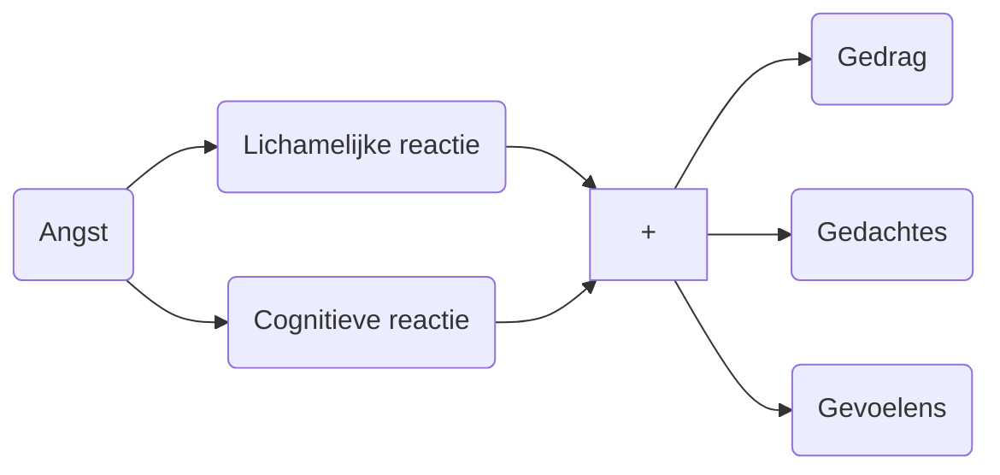

> Je kunt op basis van kennis over het limbische systeem, gedragsreacties bij angst.

# **Angst**

[[Angst]] is een reactie op een angstopwekkende prikkel. 

Angst is een van de basisemoties. 

- Basisemoties
	- Blij, boos, bang, bedroefd

**Functie angst** 
- Alarmsignaal (gevaar)
- Voorbereiding lichaam op snel handelen
- Afstand houden van het gevaar



## Lichamelijke reactie


> [!img2]- Angst in het brein
> 
> ````col
>```col-md
>flexGrow=1
>===
> </img>
>```
>```col-md
>flexGrow=1
>===
> </img>
>```
>````


1. **Angstprikkel** wordt herkend door de hersenen. 
2. De **[[Thalamus|thalamus]]** activeert hier op de **[[amygdala]]**.
3. De **amygdala** activeert de **[[hypothalamus]]** en de **[[hersenstam]].**
4. De **hypothalamus** activeert de **[[bijnier]]**
    - De hypothalamus activeert ook de [[cortex]] en de [[hippocampus]], deze sturen ook de amygdala aan → de angst wordt gemodificeert (versterken, verminderen).
5. Hierop volgen lichamelijke reacties. 

---

- **Lichamelijke reacties bij angst**
    - Snelle hartslag ([[Tachycardie|tachycardie]])
    - Hoge bloeddruk ([[Hypertensie|hypertensie]])
    - Snelle ademhaling ([[Tachypneu|tachypneu]])
    - Verhoogde spierspanning
    - Redistributie bloed naar spieren/[[duizeligheid]]
    - Trillen spieren
    - [[Mydriasis|Wijde pupillen]]
    - Droge mond
    - Moeilijker slikken
    - Zweten
    - Neigen tot mictie
    - [[Misselijkheid]]
    - [[Buikpijn]]

### Autonome reactie

Onder angst wordt de sympathicus geactiveerd en de parasympaticus gedeactiveerd. 

| Sympaticus actiever | Parasympaticus geremd |
| --- | --- |
| Snelle hartslag | Misselijkheid |
| Hoge bloeddruk | Neiging tot mictie |
| Wijde pupillen | Droge mond |
| Zweten | Moeilijk slikken |
| Redistributie bloed naar spieren |  |

### Neurotransmitters

| Verhoogd | Verlaagd |
| --- | --- |
| [[Glutamaat]] | [[Serotonine]] |
| [[Adrenaline]] | [[GABA]] |

**Angst en [[hoofdpijn]]**

- Aanspanning van de spieren kan zorgen voor een verhoogde spierspanning in de [[Anatomie extremiteiten|schouder]] en nekspieren en bijdragen aan het ontstaan van hoofdpijn.
- Verhoging van de bloeddruk kan ook bijdragen aan het ontstaan van hoofdpijn.

## Cognitieve reactie

De baan (van de cognitieve reactie) verloopt via de thalamus, naar de cortex, de hippocampus en dan naar de amygdala. Cognities kunnen de activiteit van de amygdala beïnvloeden (modificatie).

### Automatische cognitieve aspecten

**Cognitieve aspecten angst**

- Verhoogde alertheid
- Vernauwde alertheid
- Verwarde gedachten
- Verminderde [[concentratie]]
- Verminderd [[geheugen]]

**Doelbewuste cognitieve aspecten van angst**

- Twijfels
- [[Piekeren]]

---

## Gedrag

**Gedragsreactie angst**


> [!LO] Fight, freeze, flight
> - **Fight**: acties ondernemen, boos worden, agressie laten zien verbaal of lichamelijk, zich groot maken.
> - **Flight**: vermijden, zich klein maken, rusteloos, prikkelbaar.
> - **Feeze**: stil vallen, besluiteloos, geen acties ondernemen, depressie


- Stil, terug getrokken gedrag (**freeze**)
- Agressief, brutaal, stoer gedrag (**fight**)
- Prikkelbaar, gespannen, rusteloos (fight/flight)
- Vermijden angst (flight)

**Daarnaast vaak bijkomende problemen:**

- [[Concentratieproblemen]]
- [[Slaapproblemen]]

## Gedachtes

- De cortex verwerkt de lichamelijke en cognitieve veranderingen in het lichaam als gevolg van angst. Op deze manier ontstaan gedachten en gevoelens.

Deze gedachten en gevoelens volgen deels een universeel patroon, maar zijn daarnaast persoonlijk gekleurd. 

- **Gedachtes en gevoelens bij angst**
    - Dom voelen
    - Machteloos voelen
    - [[Derealisatie]] (gevoel van onwerkelijkheid)
    - [[Depersonalisatie]] (gevoel niet zichzelf te zijn)
    - Vrees voor controleverlies
    - Vrees om gek te worden
    - Vrees om dood te gaan
- **Denkfouten bij angst**
    - Zwart-wit denken
    - Zwart kijken
    - Catastrofaal denken
    - Gedachten lezen
    - Onderschatten eigen mogelijkheiden

# Angststoornis/pathologische angst

Wanneer een persoon in het dagelijks leven wordt gehinderd door angst. 

### Criteria - symptomen

- Buitensporige angst en bezorgdheid over meerdere aspecten van het leven.
    - Deze is ongewoon intens en/of langaanhoudend, ook buiten proportie.
- Angst zonder dat een angstprikkel aanwezig is.
- Irreële en irrationele perceptie van de realiteit.
- Langer dan 6 maanden aanwezig.
- Betrokkene krijgt dit niet onder controle (piekeren).

**Angst en bezorgdheid gaan samen met 3 van de onderstaande symptomen:**

- [[Rusteloosheid]]
- Snel [[vermoeid]]
- Concentratieproblemen
- Prikkelbaarheid
- [[Verhoogde spierspanning]]
- [[Slaapstoornis]]
- **Denken aan een angststoornis bij:**
    - Frequent doktersbezoek
    - Klachten: duizeligheid, [[Palpitaties|hartkloppingen]], [[globus gevoel]], [[hyperventilatie]]
    - Wisselende klachten
    - Aanhoudende [[aspecifieke klachten]]
    - Verzoek om slaap- of kalmeringsmiddelen
    - [[(Depressieve) Stemmingstoornissen|Depressieve stemming]]
    - [[Angststoornis]] in de voorgeschiedenis of familie
    - Alcohol of druksprobleem

# Behandeling angst

**[[Cognitieve gedragstherapie]]**

- Leren minder te piekeren en zorgen te maken (cognitieve therapie)
- Piekergedachten vervangen door reële gedachten
- Het aanleren van ontspanning (relaxatietraining)
- Ontspanningsoefeningen, ademhalingsoefeningen
- Opklimmende “spannendheidsgraden” leren doorstaan
- Stoppen met vermijdingsgedrag (responspreventie)

---

**Medicatie**

**[[SSRI's|SSRI]]**: verhoogt serotonine spiegel.

- Voor enkele maanden, daarna afbouwen.

**[[Benzodiazepines]]:** verhogen [[GABA]]. 

---

- **Overige behandelingen**
    - Mindfulness (cursus)
    - Psychologische begeleiding