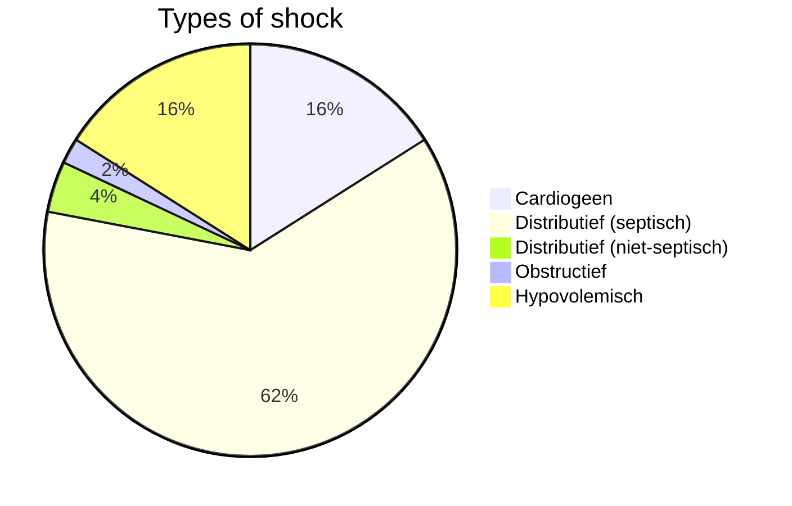
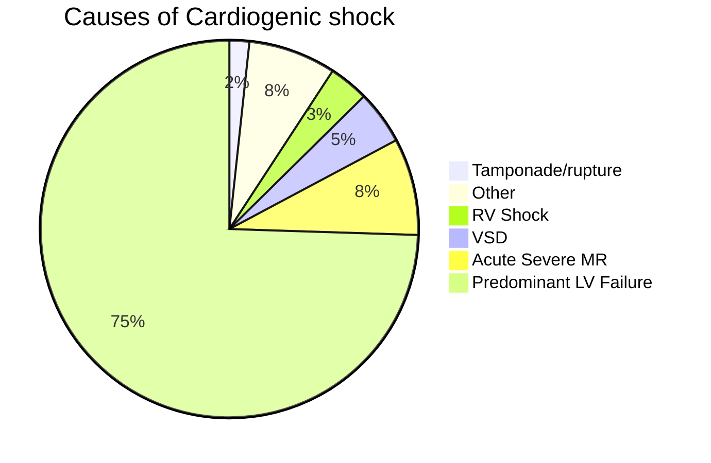

Klinisch beeld waarbij er sprake is van onvoldoende circulatie waardoor er hypoperfusie van weefsels optreedt met onvoldoende oxygenatie van de cellen.

- Cardiogeen
- Hypovolemisch
- Obstructief
- Distributief

### Pathofysiologie
- Belemmering circulatie door falen hart:
	- Pomp functie verminderd
- Gevolg: verminderde cardiac output
- → Onvoldoende weefselperfusie

---
- normaal bloedvolume en normale inhoud vaatstelsel
- → pompfalen

### Symptomen

**Decompensatie cordis**
- ↑ veneuze druk
- Pulsus alternans
- Hepatojugulaire reflux
- Verplaatste apex van hart
- Gallop ritme hoorbaar
- Mitralis insufficientie (MI) /tricuspidalis insufficientie (TI) geruis
- Perifeer oedeem
- Ascitis
- Hepatomegalie

**Low Cardiac Output**
- Koude extremiteiten
- Bewustzijn ↓
- Verwardheid
- Hypotensie
- (Carotis) pols zwak
- Tachycardie 

> [!LO] Astma cardiale
> Astma cardiale kan een klinische uiting van cardiogene shock zijn: 
> - Als ten gevolge van een verminderde pompfunctie van het hart kan het bloed niet afdoende worden weg gepompt; vanuit het linker ventrikel ontstaat er stuwing. 
> - Dan kan ook het linkeratrium en de pulmonaal venen het bloed niet goed afvoeren.
> - Hierdoor stijgt de hydrostatische druk in de longvaten. 
> - Hierdoor krijg je uittreding van vocht in de alveolaire ruimte. 
> - Hierdoor kan minder zuurstof worden opgenomen. 
> - Hierdoor wordt de patiënt benauwd en daalt de saturatie. Klinisch leidt dit tot een benauwde angstige patiënt met over de longen crepitaties.

#### Pompfunctie afhankelijk van
- Preload
- Afterload
- Contractiliteit
- Ritme
- Klep en Septumlijden

##### Preload (Eind diastolische druk/volume)

- Meer vulling is niet altijd meer output
- Passief fenomeen (vulling van ventrikel)
- Bij toegenomen wandspanning (vulling) neemt arbeid hart bij contractie toe (O2 consumptie)

##### Afterload (weestand waartegen hart uit moet pompen)
- Hoge afterload beperkt pompfunctie
- Forceert klep insufficienties (TI/MI) 
- Lage afterload geen garantie voor goede pompfunctie (coronairperfusie)

##### Contractiliteit (knijpkracht hart) verslechterd door:
- Ischaemie, Acidose
- Intoxicaties (drugs, medicatie)
- Myocarditis (inflammatie hartspier)
	- Chemisch (medicamenten)
	- Immunologisch
	- Viraal (HIV, Coxsackie B)
	- Zwangerschap- Lyme
	- etc

##### Ritme
**Bradycardiën**
- Normaal compensatie door verhoging slagvolume
- Bij beperkte systolische functie eerder problemen

**Tachycardiën** 
- Primair vullingsprobleem (geen tijd voor vulling)
- Bij slechtere diastolische functie eerder problemen

##### Klep en Septumlijden
- Insufficienties
	- Tricuspidaal insufficientie
	- Mitralis insufficientie
	- Aorta klep insufficientie

- Stenoses
	- Mitralis stenose
	- Aorta klep stenose

**Shock**
- Atrium septum defect:  geeft zelden cardiogene shock
- Ventrikel septum defect = congenitaal
- Ventrikel septum ruptuur: geeft vaak cardiogene shock

#### Etiologie

- Hartinfarct
- Totaal AV-block
- Myocarditis
- Aortastenose
- Linker ventrikel falen
- @ **Aorta dissectie**: leidt in principe niet tot een cardiogene shock. Indien de dissectie doorscheurt naar het pericard kan een obstructieve shock ten gevolge van tamponade ontstaan, of indien de dessectie doorscheurt naar de coronairen ontstaat een myocardinfarct hetgeen wel kan leiden tot een cardiogene shock.

### Diagnostiek
- **ECG** 
	- Tekenen oud Myocardinfarct
	- Ritme- of geleidingsstoornissen
	- Linkerventrikel hypertrofie
	- Linker bundeltakblok
	- ST-T afwijkingen passend bij acute ischemie
- **X-thorax**
	- Long/hart verdeling (vergroot hart)
	- Kerley-B lijntjes
	- Pleuravocht
- **Lab**
	- NT-pro BNP
	- Hb
	- Nierfunctie
	- Leverfunctie
- **Echo Cardiografie**
	- Output
	- Bewegingspatroon/stoornis
	- Klepafwijkingen
	- Wanddikte
	- Vullingsdynamiek
- **Invasieve Hemodynamische Monitoring (catheterisatie/Swan ganz)**
	- Meten drukken/vulling

### Behandeling
- **Zuurstof balans optimaliseren**
	- Vraag zuurstof te verlagen (preload, afterload, ritme)
	- Aanbod zuurstof te verhogen (Hb, inotropica)
- **Behandelen primaire lijden**
	- Pacing bij bradycardiën 
	- PTCA, CABG, klepchirurgie- Cardiac Assist devices (IABP, Impella)
- **Acute medicatie/therapie**
	- **Furosemide**: zeker geïndiceerd; geeft preload reductie door het diuretische effect en afterload reductie via venodilatatie.
	- <u>Preload doen afnemen</u>:   
		- Diuretica  
		- Nitroglycerine
	- <u>Afterload reductie</u>:  
		- **Nitroglycerine** Ook preload reductie door venodilatatie. Daarnaast ook dilatatie van coronairen waardoor het hart zelf ook meer zuurstof krijgt.
		- **Non-invasieve beademing**: 
			- Als je CPAP toediend, dus Continues Positive Airway Pressure. 
			- Dit heeft verschillende positieve effecten: 
				- Door de druk wordt het vocht teruggedrukt de longen in, daarnaast vind recruitment plaats van samengevallen alveoli. 
				- De preload neemt af door de positieve intrathoracale druk. 
				- En de afterload neemt af. 
	- <u>Contractiliteit</u>:  
		- Inotropica (dobutamine)
	- <u>Heart-rate</u>:  
		- pacen (externe pacemaker bij bradycardie)  
		- isoprenaline  
		- beta-blokkers of digoxine (bij extreme tachycardie)  
		- cardioversie (bij bepaalde ritmestoornissen)

