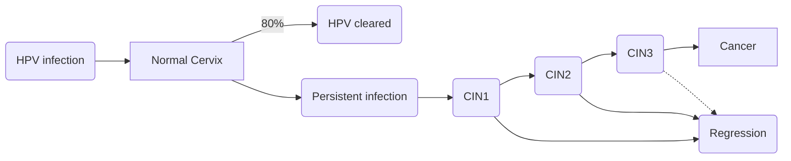

### Pathofysiologie

#### Humaan Papilloma Virus

- Sexueel overdraagbaar virus:
    - Geslachtsgemeenschap is waarschijnlijk de meest voorkomende route van baarmoederhalsinfectie, maar andere routes via vingers, tampons, speculums, enz. kunnen niet worden uitgesloten.
- 80% van alle vrouwen wordt ooit besmet
- Meeste infectie worden spontaan geklaard
- Ruim 120 verschillende types HPV
- 15 types die baarmoederhalskanker geven
- **Meest voorkomende types**: HPV 16 en HPV 18
- Zonder HPV geen cercixcarcinoom

**HPV als oncogeen virus**

- Maakt E6 (oncogeneiwit):
    - Bindt aan P53 →
    - Hierdoor kan deze zijn tumorsupressorrol niet uitvoeren →
    - Hier door is rem van de celcyclus af.
- Maakt E7 (oncogeneiwit):
    - Binding aan RB eiwit (retinoblastoma) → functieverlies van RB.
    - Celcyclus gaat erg snel lopen.
- Herhaling P53 en RB
    
    
    

**Bescherming tegen HPV?**

- HPV is seksueel overdraagbaar
- Condooms verlagen wel kans op besmetting, maar voorkomen besmetting niet volledig.
- Baarmoederhalskanker is geen soa

#### Premaligniteiten

- Het seksueel overdraagbare HPV wordt gezien als de belangrijkste factor in het ontstaan van (pre) maligniteiten van de cervix.
- Premaligne afwijkingen van de cervix veroorzaken zelden klachten. Soms gaan ze gepaard met een onregelmatige cyclus of postcoïtaal bloedverlies.
    - De premaligniteiten worden gevonden door middel van een uitstrijkje

**Indicaties voor een uitstrijkje**

- Uitnodiging van het bevolkingsonderzoek
- Herhaalde postcoïtale bloeding
- Abnormale vaginale afscheiding
- Intermenstruele bloeding
- Postmenstrueel bloedverlies
- Cervicale afwijking gevonden bij gynaecologisch onderzoek

### Beloop

- **Beloop grafiek**
    
    
    

### Histologie

**Drie graden van dysplasie:**

- **Milde dysplasie, of CIN 1**:
    - Dysplastische cellen en delingslichamen in onderste 1/3 van het epitheel.
    - Episomaal HPV: virale deel niet opgenomen in genoom.
- **Matige dysplasie, of CIN 2**:
    - Dysplastische cellen en delingslichamen tot onderste 2/3 van het epitheel.
    - Integratie van HPV in het genoom.
- **Ernstige dysplasie, of CIN 3:**
    - Dysplasie over de hele breedte van het epitheel.
    - Carcinoma in situ.

**CIN** = cervical intraepithelial neoplasma.
**LSIL** = low-grade squamous intraepithelial lesion.
**HSIL** = high-grade squamous intraepithelial lesion.

#### Cervixcarcinoom

- Meestal 15 jaar totdat tumor ontstaat.

**Transformatiezone**

- Carcinoom ontstaat in het overgangsgebied tussen de exocervix/etocervix en de endocervix.
    - **Exocervix**: meerlagig onverhoornd plaveiselcelepitheel.
    - **Endocervix**: cilindrische slijmproducerende cellen.

**2 typen**

- **Plaveiselcelcarcinoom:**
    - Kanker van de plaveiselcellen (exocervix).
    - 8/10 vrouwen met een cervixcarcinoom.
    - Meestal veroorzaakt door HPV-type-16
- **Adenocarcinoom**
    - Kanker van de cillindrische cellen (endocervix)
    - 2/10 vrouwen met een cervixcarcinoom.
    - Afwijkingen zijn vaak multifocaal. (meerdere gebieden op de cervix)
    - Meestal veroorzaakt door HPV-type-16 en HPV-type-18

*De typen kunnen ook naast elkaar voorkomen.* 

### Vaccinatie en BVO

Nederland kent een goed georganiseerd landelijk bevolkingsonderzoek (BVO) baarmoederhalskanker, daarnaast is in 2010 de vaccinatie voor hoog risico HPV (type 16 en 18) ingevoerd. In januari 2017 is het bevolkingsonderzoek vernieuwd waardoor de tekst in leerboeken vaak niet meer up to date is, de informatie op de website van het RIVM is leidend.

**Vaccinatie**:
- Effectief in voorkomen van CIN
- Resultaat t.a.v cervixcarcinoom pas over ruim 20 jaar meetbaar

**Testen**
- Beginnen met HPV detectie is beter dan cytologie
- HPV zelf-testen laten betrouwbare resultaten zien
- Op termijn kan de zelf-test mogelijk ingezet worden als alternatief voor het uitstrijkje
- Verschillende testen
    
    
    
    
    

### Diagnostiek

#### Anamnese

Roken? ooit eerder BVO? Leeftijd? Kinderwens?

#### Aanvullend onderzoek

**Colposcopie + histologie**

- Een colposcoop is een  microscoop die het oppervlak van het geïnspecteerde genitale gebied vergroot.
- Gelet op de cervix en de vagina, locatie van de afwijking en de ernst van de afwijking.

### Behandeling

- **Stadium Ia (microinvasief)**
	- Conisatie/uterus extirpatie: uitnemen kleine conus.
- **Stadium Ib/IIa (bepekt tot cervix/vagina)**
	- Radicale Hysterectomie
- **Stadium > IIb (parametrium invasie, kan niet meer met operatie genezen)**
	- Radiotherapie + chemotherapie

##### Behandeling (CIN 3)
**Lisexcisie**:
- Behandeling van de afwiking aan de baarmoedermond. 
- Oppervlakkig stukje weefsel van de baarmoederhals wordt weggenomen.

#### Links
[[Oncologie]]
