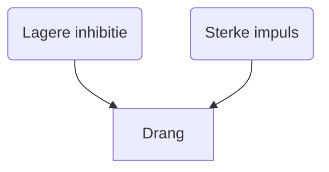

---

## Inleiding

Een drang wordt pathologisch wanneer:

- Iemand erdoor een nadelige invloed ondervindt op zijn lichamelijke en geestelijke gezondheid.
- Wanneer anderen erdoor geschaad worden in materieel opzicht of in hun lichamelijke en geestelijke integriteit.

Wanneer de behoefte aan vervulling van de drang zo intens is dat er geen of weinig rekening wordt gehouden met anderen die de vervulling ervan in de weg staan, en de grenzen van het strafrecht overschreden worden, wordt de dranghandeling een delict.

### **Drangstoornissen**

Psychiatrische stoornissen die worden gekenmerkt door een deviante of een te sterke aandrang, neiging of opwelling om een bepaalde lustvolle, ongewenste of normoverschrijdende handeling te verrichten.

Bij een te sterke aandrang kun je denken aan wensen en verlangens die zich in iemands bewustzijn opdringen om in een handeling gerealiseerd te worden en waartegen de patiënt uiteindelijk geen weerstand kan bieden. De kracht van deze drang is relatief: de drang kan op zichzelf te sterk zijn, zoals bij een verslaving of een seksuele behoefte, of de afweer tegen de realisatie ervan kan tekortschieten, bijvoorbeeld bij een persoonlijkheidsstoornis.

Bij drang streeft de patiënt enerzijds naar een belevingsaspect in de vorm van een fantasie (dranggedachte) of emotie die met die dranggedachte verbonden is, en anderzijds, afhankelijk van de omstandigheden, eventueel naar de vervulling ervan (dranghandeling). Daarna treedt dan een periode van rust en ontspanning op, totdat de dranggedachte opnieuw optreedt. Een periode van rusteloosheid begint dan weer, waarin de drangfantasie en de wijze waarop die bevredigd kan worden, steeds duidelijker vormen gaan aannemen. Deze periode kan wisselen afhankelijk van de oorzaak en aanleiding van de drang: van minuten tot maanden. De cognitieve functies blijven hierbij intact.

### **Criteria voor de drangstoornissen**

- Onvermogen om weerstand te bieden aan een impuls, drijfveer of verleiding om een handeling uit te voeren die schadelijk is voor de betrokkene zelf of voor anderen.
- Voorafgaand aan het uitvoeren van de handeling bestaat een toenemend gevoel van spanning of prikkelbaarheid.
- Na het uitvoeren van de handeling treedt plezier, opluchting of voldoening op.
- Een dranghandeling kan in strijd zijn met de wet of de goede zeden, waardoor de patiënt ernaar streeft deze te verbergen.

### **Classificatie van de drangstoornissen**

- Parafiele stoornissen:
    - exhibitionismestoornis
    - voyeurismestoornis
    - fetisjismestoornis
    - transvestiestoornis
    - scatologische stoornis
    - frotteurismestoornis
    - pedofiele stoornis
    - seksueel-masochismestoornis
    - seksueel-sadismestoornis
    - zoöfiele stoornis
    - coprofiele en urofiele stoornis
    - necrofiele stoornis

- Disruptieve, impulsbeheersings- en andere gedragsstoornissen:
    - periodiek explosieve stoornis
    - pyromanie
    - kleptomanie
    - pathologisch liegen
    - automutilatie
    

# Syndromen

## Parafilieën en parafiele stoornissen

**Kenmerken**

- Preoccupatie met een bepaalde, stereotiepe en ongewone seksuele fantasie (dranggedachte).
- Verlangen naar het moment waarop seksuele bevrediging wordt verkregen.
- Opwinding vaak op de voorgrond, maar agressiviteit soms ook aan de orde.
- Pas stoornis als er als er lijdensdruk dan wel sociaal disfunctioneren en/of schade aan derden is.

**Onderscheid**

- **Hands-on- en hands-offgedrag**: Wel of geen lichamelijk contact met het slachtoffer.

### **Hands-offstoornissen**

**Exhibitionismestoornis**

- Lust om genitaal te exposeren tegenover nietsvermoedende passanten.
    - Fantasie dat die daardoor geïmponeerd raken.
    - Meestal resulteerd dit in schrik of bespotting, maar de fantasie is dat het slachtoffer hem zal begeren om zijn seksuele uiting.
- Geen fysiek gevaar, andere kunnen zich wel bedreigd voelen of er onder leiden.
- Zover bekend alleen door *mannen.*

**Voyeurismestoornis**

- Opwinding door bespieden van personen, zonder dat die dat weten.
    - Bespieden van alledaagse activiteiten tot intieme en seksueel beladen situaties.
- Bij voyeurs bestaat de neiging zich steeds meer te laten gaan in hun activiteiten:
    - Leiden vervolgens tot insluiping, aanranding en verkrachting.

**Fetisjismestoornis**

- Specifiek voorwerp of lichaamsdeel wordt op een moment van seksuele prikkeling aan een aantrekkingskrachts verbonden → uiteindelijk orgasme.
- Het voorwerp (de fetisj) heeft vaak een algemene seksuele betekenis.
    - Ook specifieke lichaamsdelen: voet, borsten, geslacht.
- Soms zodanige aandrang dat dit leidt tot een hands-ondelict, zoals aanranding of verkrachting.

**Transvestiestoornis**

- Herhaald kleden in de kleding van de andere sekse en daar seksueel opgewonden door raken, terwijl je zichzelf wel als heteroseksueel c.q. homoseksueel blijft ervaren.
- Het door anderen in deze kleding gezien worden is geen noodzakelijk onderdeel van deze activiteit.
- Dit is geen strafbaar gedrag, maar kan wel lijdensdruk en sociale beperkingen als gevolg hebben.

**Scatologische stoornis**

Het intimiderend seksueel hijgen of obsceniteiten uitspreken of schrijven via de telefoon, een brief of sociale media, terwijl je onbekend wilt blijven, is scatologie.

### **Hands-onstoornissen**

**Frotteurismestoornis**

Frotteurisme is seksuele prikkeling ontlenen aan het aanraken of zich tegen iemand aandrukken zonder diens toestemming, bijvoorbeeld in tram of bus.

**Pedofiele stoornis**

- Seksuele fantasieën over kinderen tot in de puberteit, 13 jaar of jonger.
- Wanneer de betrokkene naar deze seksuele drang heeft gehandeld is er sprake van een pedofiele stoornis.
- Minimumleeftijd van 16 jaar oud en een leeftijdsverschil van min. vijf jaar aangenomen.
- In de klinische praktijk wordt ook wel de term ‘pedoseksualiteit’ gehanteerd:
    - Bij dit laatste is er sprake van een incidenteel en niet langdurig contact met een minderjarige.
- Homoseksuele, heteroseksuele en biseksuele variant.
    - **Incest**
        
        Incest wil zeggen dat (meestal hetero)seksueel contact wordt gezocht binnen het eigen gezin. Vaak gaat het om misbruik van de (stief)vader of -broers jegens de dochter; in die gevallen kan er sprake zijn van pedofilie of van antisociaal seksueel opportunisme; in beide gevallen bestaat er een pedofiele stoornis: de incestdader berokkent immers schade aan derden.
        

**Seksueel-sadismestoornis**

- Het zien lijden van een slachtoffer bij het bewust toebrengen van lichamelijke pijn of vernedering tegen diens uitdrukkelijke wil werkt seksuele lust op.
- Er bestaat een goedaardige variant waarbij het slachtoffer zich vrijwillig beschikbaar stelt; er is dan geen sprake van een strafbaar feit, en dus niet van een stoornis.

**Seksueel-masochismestoornis**

- Seksuele lust wordt verkregen uit lichamelijk lijden of een vernedering die door iemand anders wordt toegebracht.
- Er is vaak sprake van een sadomasochistisch samenspel met een actieve en een passieve partner.
- Wanneer beide partijen vrijwillig deelnemen, is er geen sprake van een strafbaar feit. Is dat wel het geval, dan is er sprake van een seksueel-masochismestoornis.

**Zoöfiele stoornis**

Via een coïtus of ander lichamelijk contact met een dier wordt bij herhaling gestreefd naar seksuele opwinding en een orgasme. Zowel in België als in Nederland is dit een strafbaar feit.

**Coprofiele stoornis en urofiele stoornis**

Bij coprofilie of urofilie verkrijg je seksuele opwinding door het ruiken, tot je nemen en smeren met feces of urine.

**Necrofiele stoornis**

Necrofilie is het seksueel geprikkeld raken en seksueel contact hebben met dode of bewusteloze personen.

## **Stoornissen in de impulsbeheersing**

Specifieke drang centraal staat die vanwege zijn geïsoleerde beleving een pathologische kwaliteit heeft. De patiënten die eraan lijden, beleven zichzelf niet als degene die dat gedrag overwogen heeft; zij verkrijgen er verder geen winst aan behalve het stillen van de behoefte die eraan ten grondslag ligt.

**Periodiek explosieve stoornis**

- Met tussenpozen volgen er onbeheerste uitbarstingen van woede en agressie tegen anderen of materiële zaken zoals huisraad.
- **Buitenproportioneel** in verhouding tot de aanleiding ertoe, maar enige controle bij de keuze van het object blijft bestaan.
- Spijtgevoelens achteraf treden veel op, evenals niet-gewilde verwondingen van zichzelf (zoals een gebroken pols) of anderen (bijvoorbeeld aangezichtsletsel).
- De periodiek explosieve stoornis binnen de huiselijke kring is een van de oorzaken van huiselijk geweld.

**Pyromanie**

Pyromanie is de geleidelijk toenemende drang om brand te stichten zonder een materieel winstoogmerk te hebben en zonder een duidelijk motief.

Voorpret met lustvolle fantasieën over de brand, de aandrang om tot handelen over te gaan en het, soms vergeefse, verzet daartegen, de brandstichting zelf die vaak impulsief gebeurt, en de ontspanning en trots die daar direct het gevolg van zijn.

- Geen andere stoornissen in cognitie of affect.
- Patiënten vaak eigen toeschouwer van hun eigen brand of betrokken bij bluswerkzaamheden.

**Kleptomanie**

Kleptomanie is drangmatig stelen van op zichzelf weinig waardevolle voorwerpen, waarbij het stelen lustvol is evenals het ongezien wegkomen van de plaats van de diefstal. 

- Een sombere stemming is vaak de aanleiding.
- Financiële motieven zijn niet aanwezig.
- Vooral bij vrouwen.
- Leeftijdsgebonden winkeldiefstallen door kinderen en jongeren vallen hier niet onder.

*Andere variant:* drangmatig winkelen waarbij meer geld wordt uitgegeven dan gewenst.

**Pathologisch liegen**

- Liegen is een manier van leven, iemand heeft zijn autonomie aan deze leugens ontleend.
- Patiënt liegt niet om financieel voordeel te krijgen of veroordeling te ontlopen.
- **Pseudologia fantastica**: poging tot scheppen andere identiteit door samenhangende leugens, waaraan groot gevoel van eigenwaarde wordt ontleend. Voordoen als arts of bankier.

**Automutilatie**

- Drangmatig verwonden (snijden, krabben, branden of plukken.)
- Vaak om eerder bestaande spanning of boosheid te verlichten.
    - Opluchting en plezier volgen daarna.

Automutilatie kan op zichzelf voorkomen, maar is vaak onderdeel van de andere psychiatrische stoornis zoals een depersonalisatiestoornis of een borderline-persoonlijkheidsstoornis. Bij patiënten die automutilatief gedrag vertonen, is er dikwijls sprake van psychische traumatisering in de voorgeschiedenis.

# **Ontwikkeling, beloop en gevolgen**

- Drangstoornissen ontstaan vaak in de vroege adolescentie en lijken een symptoom van een slechte sociale ontwikkeling en aanpassing.
    - Vele patiënten zijn immers sociaal geïsoleerde mensen.
- Een onomkeerbare genezing wordt nooit bereikt, recidief is hoog.
- Veel patiënten zieken niet zelf hulp, behandeling met justitiële maatregel vaak als ‘stok achter de deur’.

# **Diagnostiek**

- Moeilijk: vaak geen hulp zoeken door schaamte of dat de patiënt de drang niet als probleem ziet.
- Diagnose door contextuele aanwijzingen die de psychiater erop attent maken, zoals politiecontacten en boetes, zwerfneigingen, of wanneer een ouder slaapt of doucht met een kind van een niet meer adequate leeftijd.
    - Verder hierop doorvragen is dan noodzakelijk, waarbij rekening gehouden moet worden met ontkennen of bagatelliseren.

# DD

**Drang vs dwang**

Een onderscheid is dat dwanghandelingen worden beleefd als niet-behorend tot de eigen belevingswereld (ego­dystoon), vreemd en irrationeel derhalve, terwijl dranghandelingen deel uitmaken van de identiteit (egosyntoon).

**Ook moet drang van impulsiviteit worden onderscheiden**

- Een dranghandeling kan impulsief verlopen, maar kan ook langere tijd worden beheerst om ‘opzettelijk en doelbewust’ in daden te worden omgezet. De pleger kan genieten van zijn dranggedachten voordat hij die in handelingen omzet: een zekere controle is vaak mogelijk.
- Bij impulsiviteit daarentegen bestaat geen tussenkomst van het denken (oftewel de rede en de innerlijke afweging) tussen de behoefte en de handeling om die te realiseren. Bij impulshandelingen (‘kortsluitingsreacties’), zoals bij explosief agressief gedrag jegens anderen of zichzelf, is er daarom geen sprake van enige impulsbeheersing.co

# **Etiopathogenese**

Bij drangstoornissen is er vaak sprake van een slechte sociale ontwikkeling en aanpassing.

Een samenspel van een verhoogde drang en verminderde inhibitie. 

Een duidelijke oorzaak is niet bekend. 

**Lagere inhibitie:**

- Lichamelijke aandoening (koorts)
- Intoxicatie (alchohol)

**Sterke impuls**

- Sterke wens om de handeling uit te voeren
- Vaak haalt de handeling somberheid of matheid weg, dit vergroot de impuls om uiteindelijk te handelen.

# Behandeling

### **Parafilieën**

**Medicatie**

libidoremmende LH- of testosteronantagonisten (zoals triptoreline, medroxyprogesteronacetaat en cyproteronacetaat) en de SSRI’s

- Met wisselende resultaten
- Vaak op langer termijn veel bijwerkingen

**Cognitiefgerichte (groeps)therapieën**

Wordt tegenwoordig goed resultaat mee geboekt. 

Proberen probleemgedrag te voorkomen.

### **Stoornissen in de impulsbeheersing**

Er bestaat geen voorkeursbehandeling.

- CGT met wisselend resultaat.
- Soms antipsychotica om impulsen te dempen.

Gedragsanalyse maken en helpen alternatief gedrag te ontwikkelen; bijv als het gaat om onderliggende depressieve gevoelens deze behandelen.

Technieken operante conditionering (straffen-belonen).