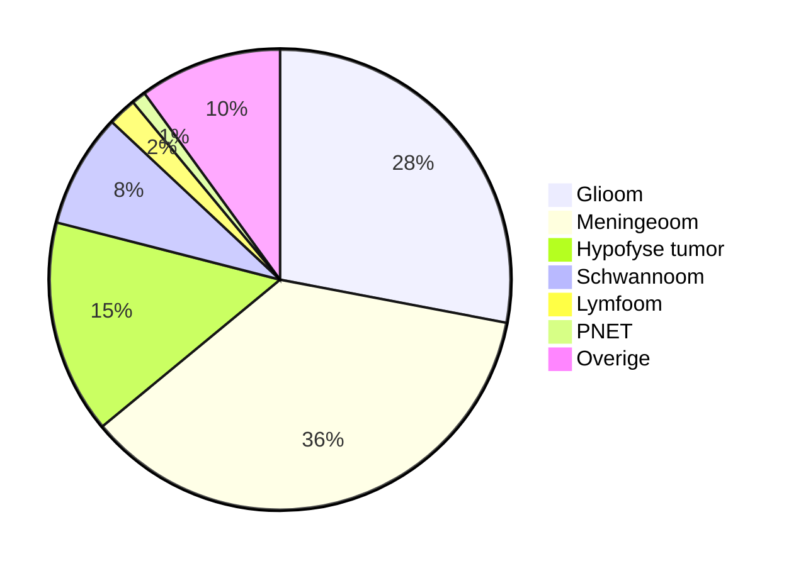

## Hersentumoren

### Diagnostiek

**Symptomen**

- Epileptische aanval
- Progressieve uitvalsverschijnselen
    - Motoriek
    - Sensibiliteit
    - Taal- of spraak
    - Visus
    - Gedrag stoornissen
- Symptomen die wijzen op verhoogde intracraniele druk
    - Progressieve hoofdpijn
        - Een snelle progressie van de hoofdpijn kan een teken zijn van een hersentumor.
    - Ochtendbraken
        - Misselijkheid in de ochtend komt bij de meeste mensen met een hersentumor niet voor, maar kan wel juist een teken zijn.
    - Visusstoornis, diplopie
    - Uiteindelijk verlaagd bewustzijn
- ! Red flags
	- Peracute hoofdpijn 
	- Progressieve hoofdpijn
	- Koorts, meningeale prikkeling 
	- Ochtendbraken
	- Nachtelijke hoofdpijn
	- VG maligniteit
	- Immuunstoornis
	- Stollingsstoornis
	- Epileptische aanvallen
	- Uitvalsverschijnselen
    
    
- **Motorische uitval**
    - 
    

**Aanvullend onderzoek**

**MRI**: het onderzoek van keuze wanneer gedacht wordt aan een intracraniële tumor, is een MRI zonder en met gadoliniumcontrast;

T2: t**w**ee, **w**ater, **w**it. 

    
- Een ruimte-innemende laesie in de linker hemisfeer van enkele centimeters met een hypointens signaal op de T1 die randaankleuring vertoont na toediening van contrast.
    - Door de ruimte innemende laesie wordt de midline verplaatst naar rechts (midline shift) en is er sprake van compressie op de laterale ventrikels.

**Definitieve diagnostiek**

- **Biopt:** bevestiging aard van de tumor.
    - (Of een resectie van de tumor te verrichten en een deel van het materiaal voor onderzoek naar het laboratorium te zenden: craniotomie).
    - Biopt wordt afgenomen door de neurochirurg.
- Tenzij er een aanwijzing is voor een primaire tumor in een ander lichaamsdeel.

### **Etiologie**

De aard van ruimte-innemende laesies in de hersenen, te zien met een MRI-cerebellum, kunnen zijn:

- Primaire hersentumor
- Hersenmetastase
- Hersenabces [^1]

---

Gezien het verhaal zijn een herseninfarct of een hersenbloeding van oudere datum minder waarschijnlijk, maar deze kunnen soms signaalafwijkingen geven die erg kunnen lijken op de aandoeningen in boven genoemde DD.

---

**Type hersentumor:**

Hersentumoren worden genoemd naar het type hersencel waar zij uit ontstaan zijn. 

- Gliacel → glioom
    - Astrocyt → astrocytoom
    - Oligodendrocyt → oligodendroglioom
    - Ependymcel → ependymoom
- Meningeale cel → meningeoom
- Schwannse cel → schwannoom
- Primitieve cel → PNET
- Lymfoide cel → lymfoom

**Primaire intracraniële tumoren**

| Goedaardige tumoren | Kwaadaardige tumoren |
| --- | --- |
| meningeomen | gliomen (astrocytomen, oligodendrogliomen, ependymomen) |
| hypofysetumoren | medulloblastomen |
| vestibulaire schwannomen | lymfomen |
| craniofaryngeomen | kiemceltumoren |
| hemangioblastomen |  |

### Epidemiologie

In Nederland diagnoses per jaar:

- 1500 patiënten de diagnose *primaire hersentumor*.
- 5000-7000 patiënten per jaar de *diagnose hersenmetastasen*.

### Erfelijkheid en hersentumoren

- Krijgen hersentumor multifactorieel bepaald
- Er zijn syndromen waarbij familieleden verhoogde kans hebben op tumoren waaronder hersentumoren.
    - Hier is bij een klein percentage van de patiënten sprake van.
- Voorbeelden van dergelijke syndromen
    1. neurofibromatose type 1
    2. neurofibromatose type 2
    3. bi-allelisch Lynch syndroom
    4. Turcot syndroom
    5. Li-Fraumeni syndroom

**[[Neurofibromatose type 1]]**

- Cafe-au-lait vlekken
- Lichtbruine vrij scherp begrensde vlekken> 1,5 cm (na de puberteit)

### WHO-classificatie

De WHO heeft alle tumoren onderverdeeld in 4 groepen, genummerd van 1 t/m 4.

- **Classificatie**
    - 
    
    - 80% van de gliomen is hooggradig, 20% is laaggradig
    - 
    

---

De WHO-indeling kijkt naar: 

- Celmorfologie (in hoeverre is het oorspronkelijk celtype nog herkenbaar)
- Hoeveelheid cellen
- Mate van celdeling
- Toename van bloedvaatjes in de tumor (neovascularisatie)
- Mate waarin er dood weefsel aanwezig is in de tumor (necrose).

---

80% van de gliomen is hooggradig, 20% is laaggradig

### Behandeling

**Operatie**

*Doel*

1. verkrijgen histopathologische diagnose
2. massareductie -> hoe kleiner de rest, hoe beter de prognose
3. symptoom verlichting
4. behandelen bijkomende problemen zoals hydrocefalus
- NB proberen zo min mogelijk schade te veroorzaken

****Behandelmogelijkheden tumoren****

- Operatie
    - Streven naar totale macroscopische resectie, zonder veroorzaken nieuwe symptomen
- Radiotherapie
- Chemotherapie

| Tumor | Behandeling |
| --- | --- |
| Laaggradig glioom | Operatie of operatie en radiotherapie |
| Hooggradig glioom | Operatie, radiotherapie en chemotherapie |
| Oligodendroglioom | Operatie en chemotherapie |
| Meningeoom | Operatie, soms operatie en radiotherapie |
| Schwannoom | Operatie of radiotherapie |
| Hypofyse tumor | Medicatie en/of operatie |

**Prognose**

*Mediane overleving*

**Laaggradig glioom**: +/- 14 jaar

**Hooggradig glioom**: +/- 15 maanden

### Meningeoom

Meningeoom kleuren op de MRI met contrastvloeistof vaak egaal aan. 

Meningeomen zitten en aan de convexiteit, duwen normaal hersenweefsel aan de kant.

**Dural tail:** verbinding met de meningen. 

****Behandeling meningeomen****

1. kleine tumor en geen groei -> expectatief beleid, wait and scan
2. klachten en/of groei tumor-> operatie, streven naar totale resectie
3. operatie niet mogelijk of groeiende resttumor na operatie-> radiotherapie

### **Prolactinoom**

**Behandeling prolactinoom**

- In eerste instantie vaak medicamenteus met dopamine-agonisten.
- Dopamine heeft namelijk effect op de afgifte van prolactine.
- Wanneer dit onvoldoende effect heeft, kan in tweede instantie een operatie noodzakelijk zijn.
- 
[[Hypofyse]]    

## Hersenmetastasen

| Longcarcinoom | 40-50% |
| --- | --- |
| Mammacarcinoom | 20% |
| Melanoom | 10% |
| Niercelcarcinoom | 7% |
| Tractus digestivuscarcinoom | 6% |
| Gynaecologisch | 5% |

**Uitzaaiingen primaire tumor**

- 1) Hersenen zelf
- 2) Hersenvliezen
- 3) Epidurale ruimte (vaak vertebraal)

**Symptomen epidurale metastasen**

- Rugpijn, al dan niet met uitstraling
- Compressie myelum met partiële dwarslaesie symptomen
    - Krachtsverlies
    - Sensibiliteitsverlies
    - Incontinentie problemen

Rugpijn bij een patiënt die bekend is met een primaire tumor is dus een red flag voor onderliggende problematiek !

**Behandeling hersenmetastasen**

1. Dexamethason indien uitvalsverschijnselen
2. Behandeling primaire tumor met chemotherapie indien deze chemotherapie gevoelig is
3. Radiotherapie
    - Stereotactisch (alleen lokale radiotherapie) <= 4 metastasen kleiner dan 3,5 cm
    - Totale schedelbestraling bij> 5 metastasen

**Solitaire laesie**

1. Goed lichamelijk onderzoek naar tekenen van primaire tumor
2. CT thorax en abdomen
3. resectie van de laesie (of biopt) en PA-diagnose

**Prognose hersenmetastasen**

- Mediane overleving 4 maanden, maar hangt sterk samen met gedrag primaire tumor
- 10-15% leeft langer dan 1 jaar
- Overlijden meestal aan de gevolgen van de primaire tumor

[^1]: [[Abces]], [[Hersenabces]], [[Oncologie]]