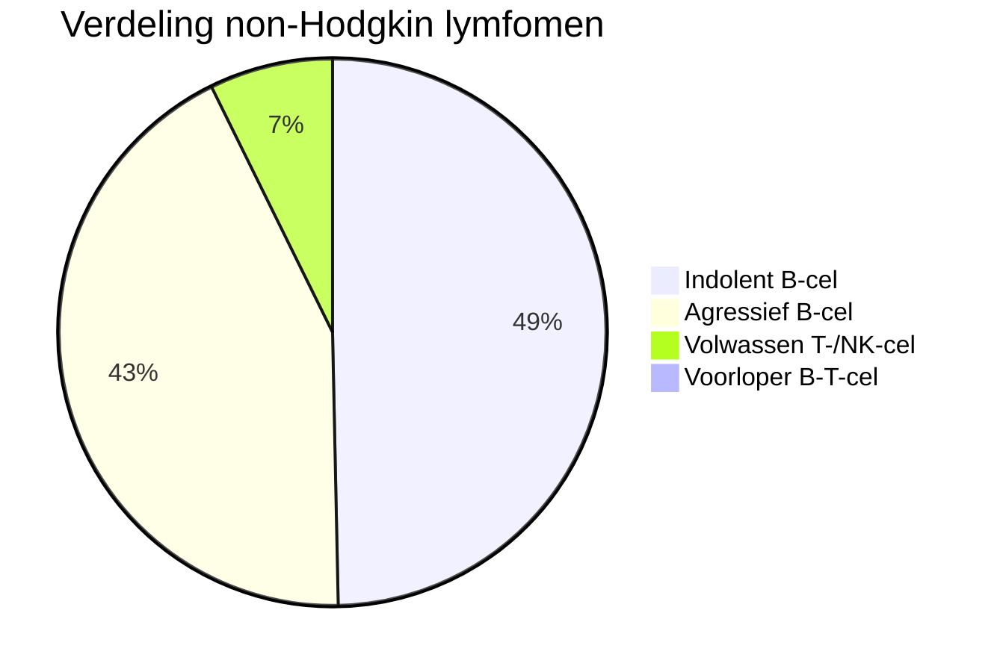
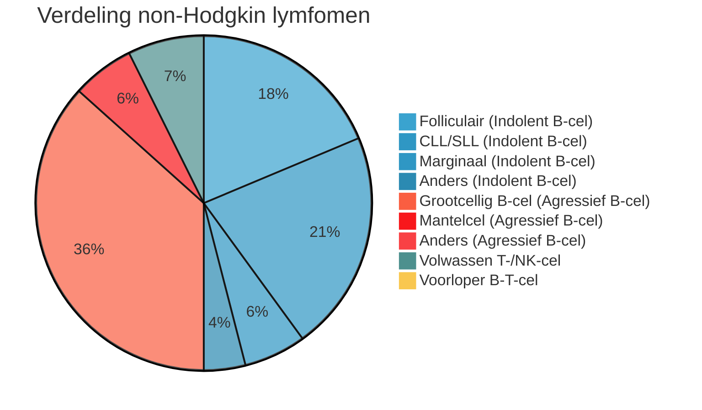

#### Definitie
- Het NHL is een grote heterogene groep met meerdere ziekte-identiteiten. 
- De diagnose wordt gesteld aan de hand van een biopt. 
- De morfologie en immunohistochemie spelen een belangrijke rol bij het stellen van de diagnose en onderscheiden van de verschillende vormen NHL;
- Voor stadiëring wordt met beeldvorming gekeken waar in het lichaam het NHL aanwezig is; 
- Het agressieve diffuus grootcellig B-cellymfoom en het indolente folliculair lymfoom zijn samen de meest voorkomende vormen van NHL.

### Diffuus grootcellig B-cellymfoom 
#### Kliniek
- Met 30-40% het meest voorkomende type lymfoom;
- De ziekte openbaart zich meestal met een snel in omvang toenemende nodale of extranodale massa => circa 50% is primair extranodaal gelokaliseerd;
- Bij 30% is het beenmerg aangetast; 

#### Diagnostiek 
- Expressie van CD20 en BCLS6, + of - voor CD10 en meestal CD5-; 

#### Behandeling
- R-CHOP kuren (combinatie van rituximab en CHOP-kuren); 
- **Stadium I**: 3 R-CHOP kuren gevolgd door radiotherapie of 6 R-CHOP kuren => 80% curatie;
- **Stadia II-IV**: 6-8 kuren R-CHOP. Met de IPI-score kunnen degene met goede prognose onderscheiden worden van degene met slechte prognose;
- Bij **recidief** na R-CHOP volgt 2e-lijns chemotherapie die bij respons gevolgd wordt door autologe stamcelstransplantatie met hoge dosis chemotherapie; 
	- Bij recidief is de prognose veel slechter.

### Folliculair lymfoom

#### Kliniek
- Vaak presentatie met gegeneraliseerde lymfadenopathie (stadium III), bij 60-70% van de patiénten is het beenmerg aangetast (stadium IV); 
- Systemische symptomen zijn zeldzaam;
- Indolent lymfoom, de ziekte kenmerkt zich door frequente recidieven;
- Mediane overleving is 10-15 jaar, curatie wordt zelden bereikt; 

#### Diagnostiek
- Expressie van CD10, BCL6 en CD38 en afwezigheid van CD5 past bij dit type lymfoom. 

#### Behandeling
- (<10%): radiotherapie op aangedane klieren (70% ziektevrije 10-jaar overleving);
- II: (<5%): radiotherapie indien mogelijk, langere remissie i.c.m. rituximab;
- I/IV: vaak wait and see, omdat er geen curatieve behandeling is. 
- Vroeg starten heeft geen gunstig effect op overleving. 
- Bij klachten (mechanische bezwaren of beenmergverdringing) wel behandelen: 
	- Radiotherapie bij beperkte klachten; 
- R-CVP is 1e keus (8 cycli), bij ouderen chloorambucil + rituximab; 
- Onderhoud met rituximab verlengt progressie vrije overleving; 
- SCT alleen in geselecteerde gevallen vanwege morbiditeit en mortaliteit.