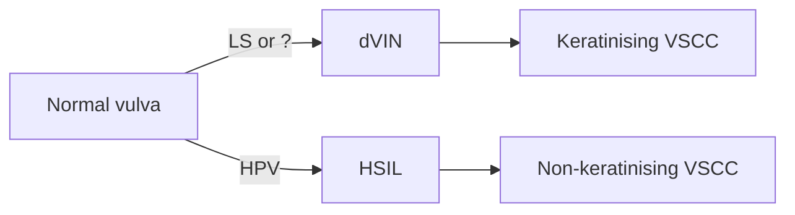

# Maligniteiten

### **Epidemiologie**

- Maligne aandoeningen van de vulva zijn relatief zeldzaam:
    - 230-350 patiënten per jaar in Nederland. Huisarts maar 2 patiënten in zijn leven met dit type kanker.
    - Zorgt voor een opvallende patiënt- maar ook dokters delay.
- **Toename incidentie**

### **Klachten**

Ook het klachtenpatroon is niet echt richting gevend. Genoemde neoplastische en niet-neoplastische vulva afwijkingen hebben dezelfde symptomatologie (jeuk, irritatie, brandende pijn en dyspareunie).

### Histologie

**Types**

- 80% plaveiselcelcarcinoom (vulvar squamous cell carcinoma; VSCC)
- Rest overige types; waaronder:
    - Basaalcelcarcinoom
    - Melanoom
    - Adenocarcinoom
    - Sarcoom
    - Lymfoom

### **Pathofysiologie**

---

Er zijn twee ontstaanswijzen van het plaveiselcelcarcinoom:

- De meest voorkomende vorm ontstaat in een achtergrond van lichen sclerosus (LS) vanuit differentiated VIN (dVIN).
- Minder vaak (15-20%) ontstaat het via het HPV geassocieerde usual VIN (uVIN).
- Andere maligniteiten van de vulva zijn nog zeldzamer zoals melanoom of adenocarcinoom.

**Premaligniteiten van de vulva en het vulvacarcinoom**

uVIN is HPV gerelateerd, ontaardingskans 15-20% / dVIN gerelateerd aan LSEAV, 5% LSEAV ontaard maligne

### Stadiering

**Stadiering op basis van**:
- Grootte tumor
- Lokalisatie
- Invasiediepte
- Aanwezigheid van metastasen
    - Metastasering initieel naar lymfeklieren in de lies

**Prognose**

Lieskliermetastasen zijn een belangrijke prognotische factor

- Vroeg stadium zonder metastasen: 5-jaars overall survival 70-93%
- Met lymfekliermetastasen: 5-jaars overall survival 25-41%

### Diagnose

#### Anamnese

Jeuk, branderigheid, ongemak, pijn, bloedverlies, dysurie en huidafwijking. 

 - **Algemene (gynaecologische) voorgeschiedenis**
	 - Medicatiegebruik, intoxicaties (roken), allergieën, operaties, ziekten, atopie, laatste cervixcuitstrijk, SOA's, huidziekten
- **Speciele en tractus anamnese**
- **Seksuologische anamnese**
    - Hulpvraag, communicatie en beleving
    - Seksuele responscyclus
    - Sociaal, relationeel en psychisch
    - Voorgeschiedenis en opvoeding

#### Lichamelijk onderzoek

**Vulva én liezen beiderzijds**

- Inspectie genitale gebied
- Palpatie van de liezen
- Speculum onderzoek
- Vaginaal toucher
- **Detail**
    - Inspectie en palpatie van de liezen
    - Inspectie gehele anogenitale gebied
        
        *Inspectie van de behaarde huid (mons pubis, labia majora)*
        
        *Inspectie labia minora en vestibulum*
        
        *Q-tip touch test*
        
        *Inspectie perineum en anus*
        
        *Inspectie bilnaad (terwijl patient staat)*
        
    - Speculum onderzoek
        
        *Aspect fluor*
        
        *Vaginale mucosa*
        
        *Cervixafwijkingen (op indicatie: uitstrijkje)*
        
    - Vaginaal toucher
        
        *Aanwezigheid stricturen/adhesies*
        
        *Tonus bekkenbodemspieren*
        
        *Pijn*
        
        *Op indicatie: palpatie uterus en adnexa*
        
    - Op indicatie: transvaginale echo
- **PROVOKE**
    
    Een systematische werkwijze om aandoeningen van de huid te omschrijven is een omschrijving van 'PROVOKE'.
    
    P = Plaats *bijv. genitaal (=vulva, perineum, anus) of liezen*
    
    R = Rangschikking *bijv. gegroepeerd, diffuus*
    
    O = Omvang (aantal, grootte)
    
    V = Vorm bijv. *rond of ovaal, verheven*
    
    O = Omtrek (begrenzing) bijv. *scherp, matig scherp, onscherp*
    
    K = Kleur *bijv. rood, erytheem, purpura*
    
    E = Efflorescentie(s) *Dit zijn de elementen waaruit de huidafwijking is opgebouwd.*
    

**Aanvullend onderzoek**

- Biopt van laesie op de vulva, soms is 'vulvamapping' geïndiceerd waarbij op meerdere locaties op de vulva biopten worden genomen.
- Beeldvorming van beide liezen middels echo
- Bij suspecte klieren een cytologische punctie.
- X-thorax.

### **Behandeling**

- In het algemeen primair chirurgische behandeling
- Beperkte rol voor primaire radio- of chemotherapie

---

- Ruime lokale excisie tumor
    - Verwijderen van de tumor met rondom een marge van minimaal 1 cm
- Sentinel node procedure en/of inguinofemorale liesklier dissectie

**Sentinel node procedure**
- Sentinel node procedure **in de lies!**

- Bij:
	- Primair unifocaal VSCC
	- Invasie diepte > 1mm
	- Diameter <4 cm
	- Geen verdachte lymfeklieren bij lichamelijk onderzoek en beeldvormend onderzoek

**Inguinofemorale liesklier dissectie**

- SN positief
- Geen indicatie voor SN
- Bij bewezen kliermetastasen
- Lokaal recidief VSCC

## Premaligniteiten

- **[[Lichen sclerosus]]**
	- Huidaandoening gekenmerkt door atrofie (‘sigarettenpapier’) en/of hyperkeratose, macroscopisch herkenbaar als scherp begrensde, porseleinwitte glanzende plekken, op den duur aanleiding gevend tot anatomische veranderingen, zoals verdwijnen van de labia minora en vernauwing van de introïtus vaginae.

**Behandeling**

- Hormoonzalf

**VIN**
Vulvaire intra-epitheliale neoplasie (VIN), uitgaande van het plaveiselepitheel. Deze worden onderverdeeld in vulvaire HSIL (high grade squamous intra-epithelial lesion) en differentiated VIN.

**Behandeling**

- Excisie / laser / uVIN immiquimod

**Bij rol HPV**

- Screening cervix

---

*Overige aandoeningen*

- **Fluor = vaginale afscheiding. Fysiologisch, maar kan pathologisch zijn:**
    
    **Pathologisch**
    
    Bij pathologische fluor kan er sprake zijn van vulvitis, colpitis (=vaginitis), cervicitis en endometritis. De klachten kunnen bestaan uit pijn, branderigheid (ook bij urineren), vulvaire jeuk (pruritus vulvae) en dyspareunie.
    
    De meest voorkomende oorzaak van pathologische fluor is een infectie met *Candida albicans* (vulvovaginale candidosis, 35%), gevolgd door *bacteriele vaginose* (20%). Dit zijn lastige maar onschuldige aandoeningen die meestal beperkt blijven tot de vagina.
    
    Andere oorzaken van pathologische fluor zijn;
    
    - *SOA's*: Trichomonas, Chlamydia en gonorrhoe
    - *Maligniteit*: Cervixcarcinoom, endometriumcarcinoom (zeldzaam)
    - *Corpus alienum*
- **Vulvovaginale candidosis**
    - *80-95% Candida Albicans* als oorzaak.
    - Piekleeftijd 20-30 jaar.
    - Veroorzaakt colpitis en/of vulvitis.
    - Risicofactoren:
        - Antibiotica gebruik
        - Diabetes mellitus
        - Zwangerschap
        - Immuundeficiëntie
- **Bacteriele vaginose**
    - Gardnerella vaginalis
    - Pathogenese onduidelijk
    - Afname vaginale zuurgraad
    - Risicofactoren: verstoring vaginale milieu, veel zeep, frequente coïtus, antibioticagebruik.